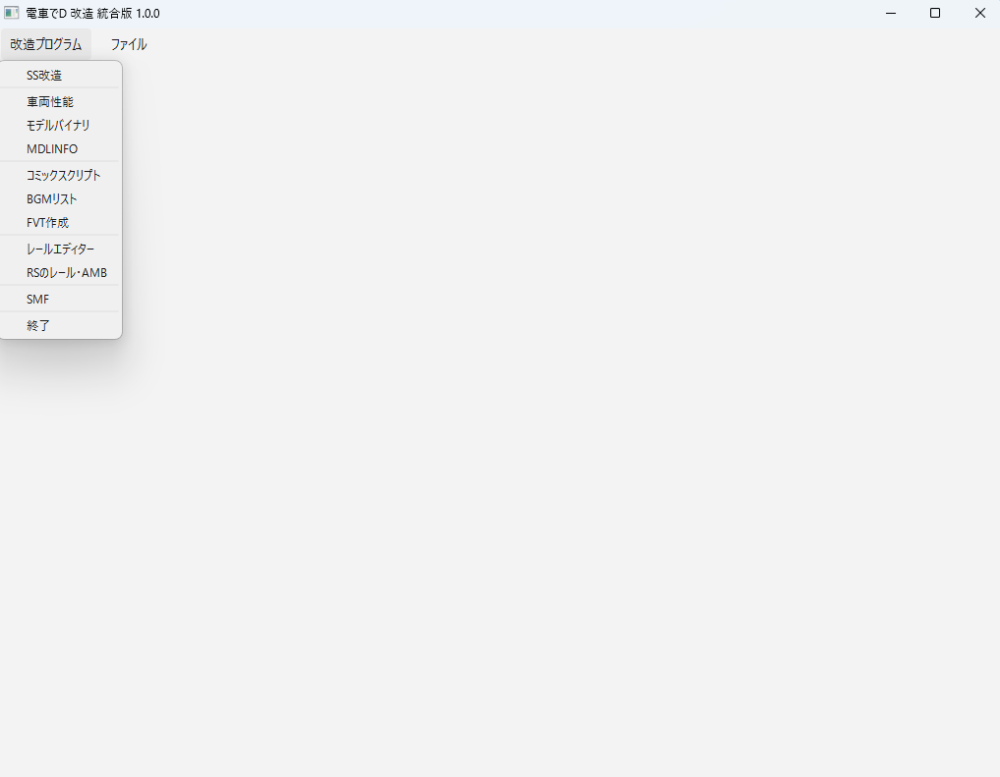
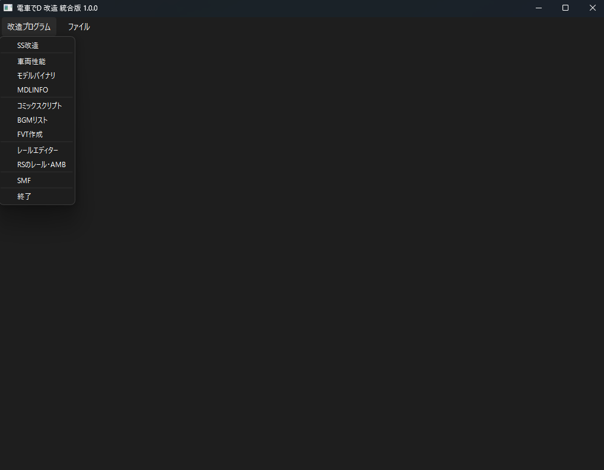

*[日本語](README.md)*

# dend-mod-gui-pyside6
PySide6 version of the Densha de D integrated modification program

## Overview

dend-mod-gui-pyside6 is software for editing Densha de D data modifications through a GUI screen.
(PySide6 version)

## Operating Environment

* A computer capable of running Densha de D
* OS: Windows 11 64bit, latest update
* An OS terminal that supports Japanese

*Note: operation on Unix-like OSes such as MacOS or Linux cannot be guaranteed.

## Disclaimer

The creator bears no responsibility for any damage that occurs from using this program.

Before running this program, take a full backup of your own computer and ensure your safety before proceeding.
Do not contact Jinushi Ippa, the creator of Densha de D, regarding this program.

Updating or fixing bugs in this software is not an obligation of the author, but a best-effort goal.
Bug information raised in Issues is not guaranteed to be fixed.

* License: MIT

You must hold a legitimate license for Densha de D.

Should litigation become necessary in connection with this program, the Tokyo District Court shall have exclusive jurisdiction as the court of first instance.

By running the binary of this program, you are deemed to have agreed to these terms.

## How to Run

Light version

Dark version

In the menu's "Modification Program", select the type of program you want to modify.

In the menu's "File" -> "Open File", open the specified BIN file.

Be sure to work in a location where the program has write access.

### SS Modification

For usage instructions, see the [link here](/program/sub/ssUnity/README.md).

### Train Modification

For usage instructions, see the [link here](/program/sub/orgInfoEditor/README.md).

### Model Binary

For usage instructions, see the [link here](/program/sub/mdlBin/README.md).

### MDLINFO

For usage instructions, see the [link here](/program/sub/mdlinfo/README.md).

### Comic Script

For usage instructions, see the [link here](/program/sub/comicscript/README.md).

### BGM List

For usage instructions, see the [link here](/program/sub/musicEditor/README.md).

### FVT Creation

For usage instructions, see the [link here](/program/sub/fvtMaker/README.md).

### Rail Editor

For usage instructions, see the [link here](/program/sub/railEditor/README.md).

### RS Rail/AMB

For usage instructions, see the [link here](/program/sub/rsRail/README.md).

### SMF

For usage instructions, see the [link here](/program/sub/smf/README.md).
