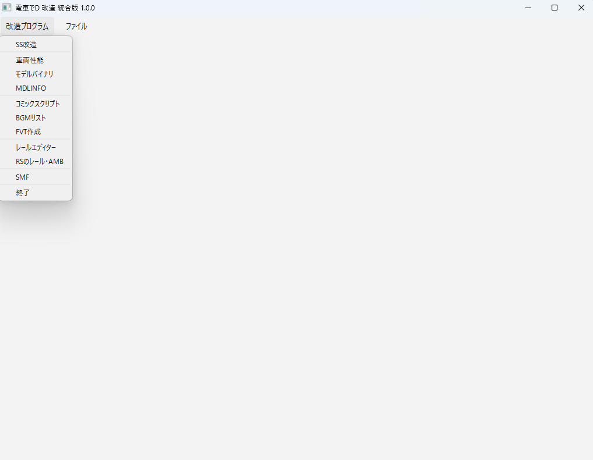
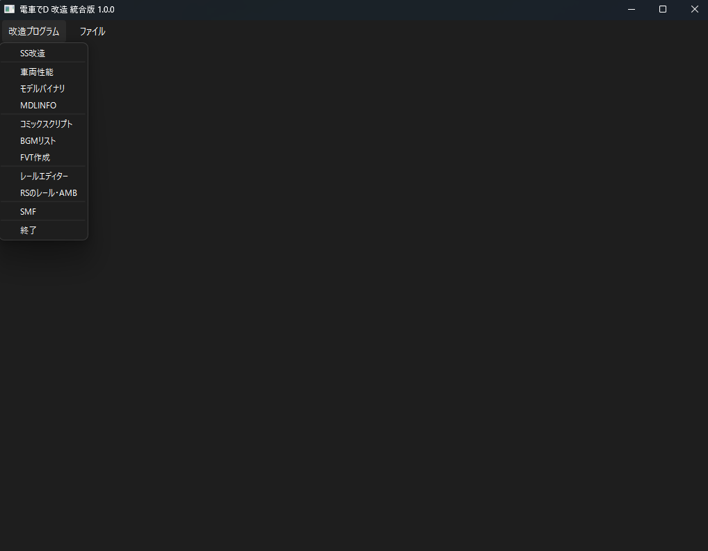

# dend-mod-gui-pyside6
PySide6バージョンの、電車でDのプログラム統合版

## 概要

dend-mod-gui-pyside6は、電車でDのデータ改造のため、GUI画面上で編集するソフトウェアである。
(pyside6バージョン)

## 動作環境

* 電車でDが動くコンピュータであること
* OS: Windows 11 64bit の最新のアップデートであること
* OSの端末が日本語に対応していること

※ MacOS 、 Linux などの Unix 系 OS での動作は保証できない。

## 免責事項

このプログラムを使用して発生したいかなる損害も製作者は責任を負わない。

このプログラムを実行する前に、自身のコンピュータのフルバックアップを取得して、
安全を担保したうえで実行すること。
このプログラムについて、電車でD 作者である、地主一派へ問い合わせてはいけない。

このソフトウェアの更新やバグ取りは、作者の義務ではなく解消努力目標とする。
Issue に上げられたバグ情報が必ず修正されるものではない。

* ライセンス：MIT

電車でD の正式なライセンスを持っていること。

本プログラムに関連して訴訟の必要が生じた場合、東京地方裁判所を第一審の専属的合意管轄裁判所とする。

このプログラムのバイナリを実行した時点で、この規約に同意したものと見なす。

## 実行方法

ライトバージョン

ダークバージョン

メニュの「改造プログラム」で改造したいプログラム種類を選ぶ。

メニュの「ファイル」→「ファイルを開く」で指定のBINファイルを開く。

必ず、プログラムが書込みできる場所で行ってください。

### SS改造

実行方法は、[【こちら】](/program/sub/ssUnity/README.md)のリンクを参照

### 車両改造

実行方法は、[【こちら】](/program/sub/orgInfoEditor/README.md)のリンクを参照

### モデルバイナリ

実行方法は、[【こちら】](/program/sub/mdlBin/README.md)のリンクを参照

### MDLINFO

実行方法は、[【こちら】](/program/sub/mdlinfo/README.md)のリンクを参照

### コミックスクリプト

実行方法は、[【こちら】](/program/sub/comicscript/README.md)のリンクを参照

### BGMリスト

実行方法は、[【こちら】](/program/sub/musicEditor/README.md)のリンクを参照

### FVT作成

実行方法は、[【こちら】](/program/sub/fvtMaker/README.md)のリンクを参照

### レールエディター

実行方法は、[【こちら】](/program/sub/railEditor/README.md)のリンクを参照

### RSのレール・AMB

実行方法は、[【こちら】](/program/sub/rsRail/README.md)のリンクを参照

### SMF

実行方法は、[【こちら】](/program/sub/smf/README.md)のリンクを参照
