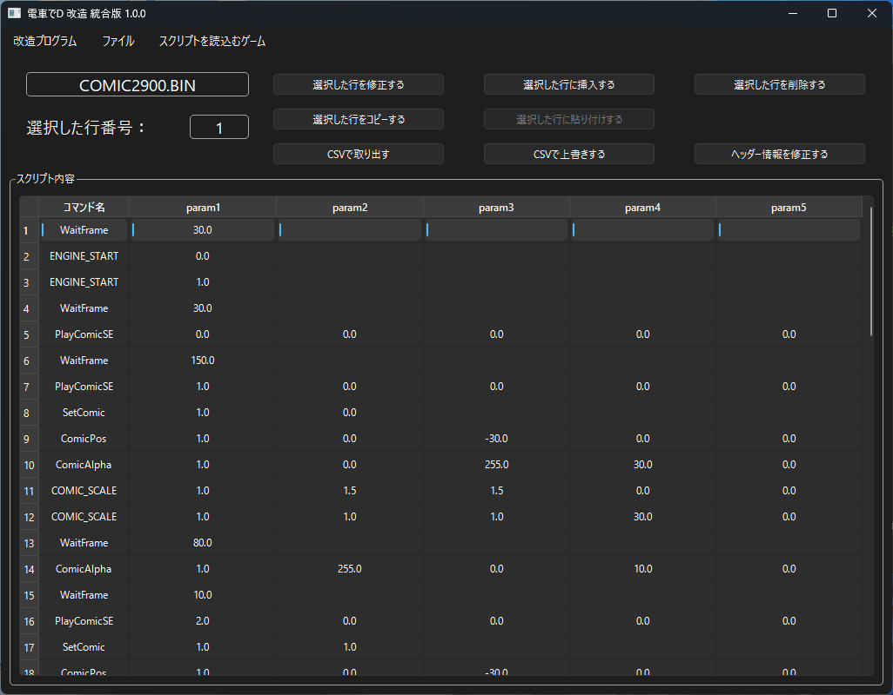
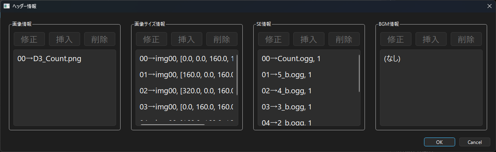
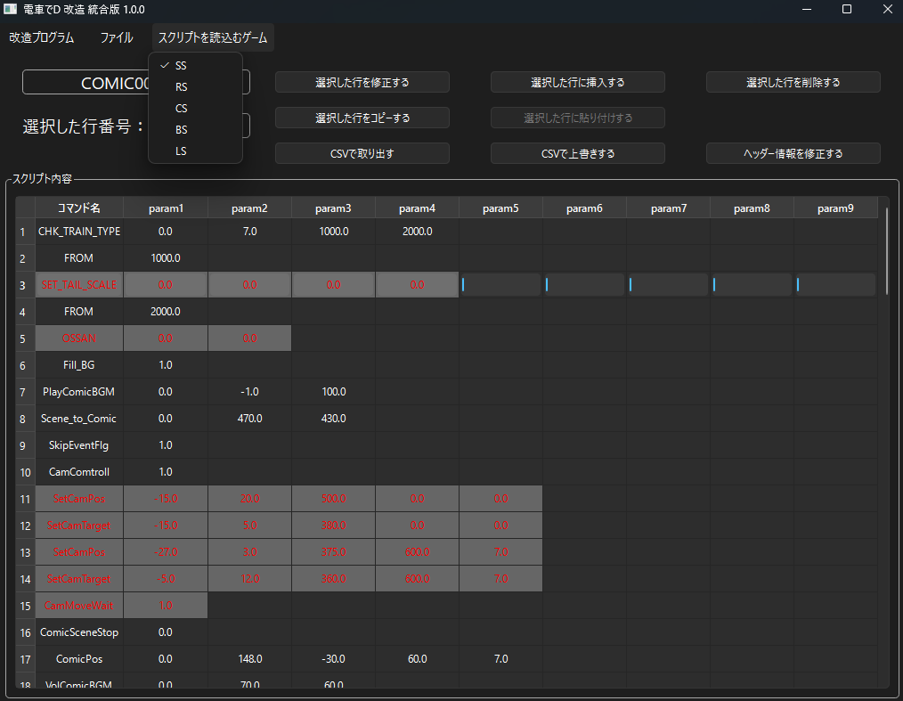

*[日本語](README.md)*

# Comic Script

## How the Comic Script Works

For details on how the script works, see the [【here】](/program/sub/comicscript/script.md) link.

## Command List

For the command list, see the [【here】](https://khttemp.github.io/dendData/comicscript/cmdList.html) link.

## How to Run

1. Open "COMIC*.BIN" via "Open File" in the menu.

    Be sure to do this in a location where the program can write.

2. Select the row you want to edit.

3. Use the "Modify Selected Row" button to modify the command or its parameters.

4. Use the "Insert at Selected Row" button to insert a new command.

5. Use the "Delete Selected Row" button to delete the specified row.

6. Use the "Copy Selected Row" button to copy the specified row.

    Pressing the button activates the "Paste at Selected Row" button.

7. Use the "Paste at Selected Row" button to insert the most recently copied row.

8. Changes are saved immediately once made.

9. Use the "Extract as CSV" button to export the current Comic Script as a CSV.

10. Use the "Overwrite from CSV" button to overwrite the current Comic Script with a CSV you created.

## How to Modify Header Info

Use the "Modify Header Info" button to modify the header information of the current Comic Script.

You can respectively modify the image file, the image file's size adjustment,

SE information, and BGM information.

However, detailed settings such as SE information group retrieval or BGM information loop settings

are not applied in SS.

## Determining Which Scripts Can Run

When you select a game in the options and load a script,

scripts that cannot be run are displayed in red text.

### FAQ

* Q. I have the Densha de D game, but there's no COMIC*.BIN. 
  
  * A. For older titles up through Rising Stage, you can obtain it by extracting the Pack file

    with an archiver such as GARbro.

  * A. If you extract with GARbro using a blank password, you'll get an invalid file, so enter the correct password.

* Q. Even when I specify the BIN file, I'm told "This is not a Densha de D comic script, or the file may be corrupted."

  * A. The extraction method might be wrong, or the password used during extraction might be wrong. You should redo the extraction process.

* Q. I modified the BIN file, but nothing changed?

  * A. For older titles up through Rising Stage, if the original Pack file and its extracted folder both exist at the same time,

    the Pack file may be taking priority when loading.

    To keep it from being loaded, modify or delete the extracted Pack file.

    For Shining Stage, the "newest" "ver*" folder under InGameData may be taking priority when loading.

* Q. The download gets blocked, execution gets blocked, or my security software deletes it.

  * A. Since the software isn't code-signed, some browsers may block the download.
  * A. For the same reason, security software may also refuse to let it run.

That's all.
