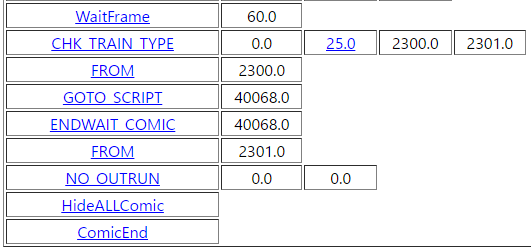

*[日本語](script.md)*

# How Comic Script works

※ Excerpted from SS's Comic Script COMIC40068.bin

Fundamentally, a Comic Script is largely made up of two things:

the command to execute, and its parameters.

Here, we'll explain with a simple example.

For a more detailed explanation of commands, see [【here】](https://khttemp.github.io/dendData/comicscript/cmdList.html).

## 1. WaitFrame

Script execution basically finishes in units of a few frames.

### WaitFrame, Parameter 1

This command waits for script execution by the amount written in Parameter 1.

Since Parameter 1 is "60.0", it waits 60 frames.

## 2. CHK_TRAIN_TYPE

Determines the type of the current train car.

### CHK_TRAIN_TYPE, Parameter 1

Since Parameter 1 is "0.0", the 1P car is the target.

If it were "1.0", the 2P car would be the target.

In story mode, 2P is treated as the CPU's car.

In test run mode, this becomes an invalid value, so be careful.

### CHK_TRAIN_TYPE, Parameter 2

Since Parameter 2 is "25.0",

this refers to "H2300" as defined by the internal code.

In other words, combined with the above,

this command becomes a conditional judging whether the 1P car is a Hankyu 2300 series.

### CHK_TRAIN_TYPE, Parameters 3 and 4

According to the result of the above conditional judgment,

it jumps to a FROM command explained later.

When jumping, starting from the current command,

it stops at the very first line where the FROM command's parameter matches.

If the FROM command wasn't defined, this can result in an error.

 

Since Parameter 3 is "2300.0" and Parameter 4 is "2301.0",

if the above conditional is True, it follows Parameter 3;

if the conditional is False, it jumps to Parameter 4.

## 3. FROM

A label command for corresponding to a "jump" command,

such as CHK_TRAIN_TYPE, based on a condition.

Other than being a label, it has no special behavior, so it immediately proceeds to the command below.

## 4. GOTO_SCRIPT

A command used to launch a Comic Script in parallel.

### GOTO_SCRIPT, Parameter 1

In this case, since Parameter 1 is "40068.0",

it launches COMIC40068.BIN in parallel,

and immediately proceeds to the command below.

## 5. ENDWAIT_COMIC

A command that keeps waiting until the running script finishes.

Mostly used together with GOTO_SCRIPT.

### ENDWAIT_COMIC, Parameter 1

In this case, since Parameter 1 is "40068.0",

it keeps waiting until COMIC40068.BIN finishes.

## 7. NO_OUTRUN

A command to prevent the train from derailing.

### NO_OUTRUN, Parameter 1

Since Parameter 1 is "0.0", the 1P car is the target.

### NO_OUTRUN, Parameter 2

Since Parameter 2 is "0.0", the derailment-prevention flag is set to False.

In other words, the car returns to the default state where it can derail.

If the parameter were set to "1.0",

the derailment-prevention flag would be set to True,

preventing derailment under any circumstances.

The derailment-prevention flag is mainly used in cases like camera events,

where the viewpoint changes and proper cornering can't be handled correctly.

## 8. HideALLComic

A command to hide all comics.

## 9. ComicEnd

Ends the Comic Script.

Every Comic Script should always end with this as its final command.
