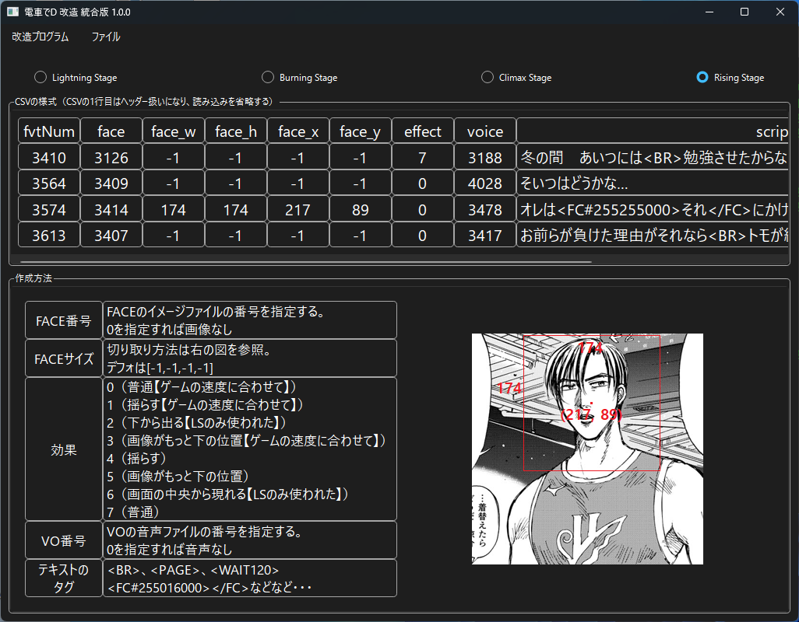

*[日本語](README.md)*

# FVT Creation

## How to Run

1. Select the game using the radio button.

    Doing so lets you see an example of the CSV format.

    Make sure the text uses characters that can be converted to Shift-JIS.

2. Open the CSV file via "Open File" in the menu.

3. Clicking the OK button creates an FVT file based on the loaded CSV.

### FAQ

* Q. The download is blocked, execution is blocked, or security software deletes it

  * A. Since it isn't software-signed, some browsers may block the download
  * A. For the same reason, security software may also refuse to run it.

That's all.