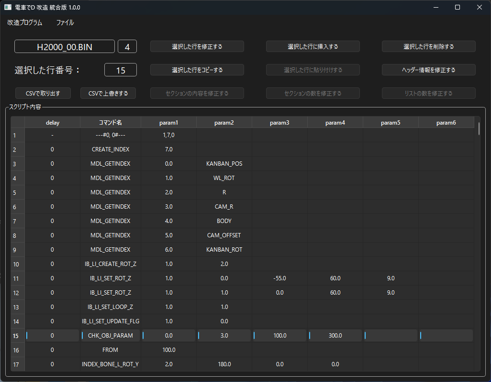
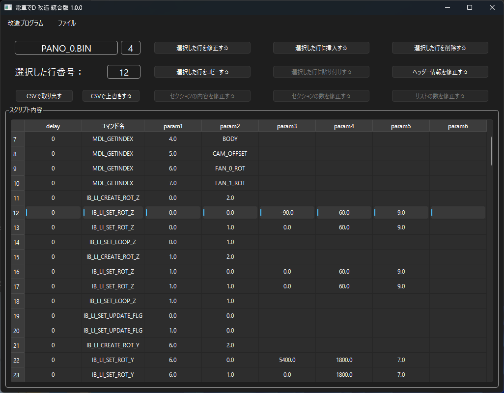
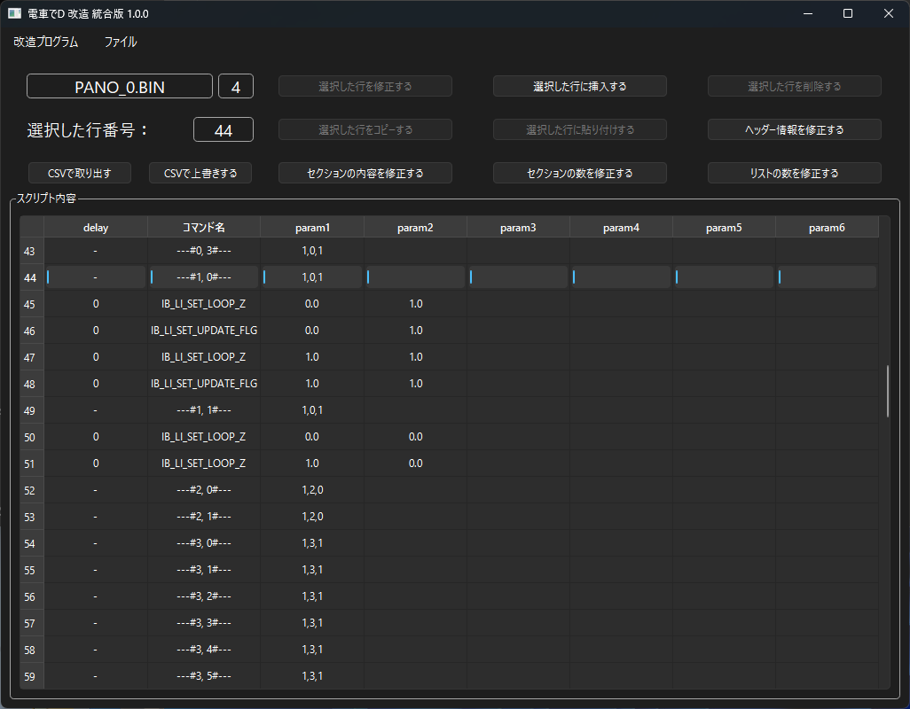
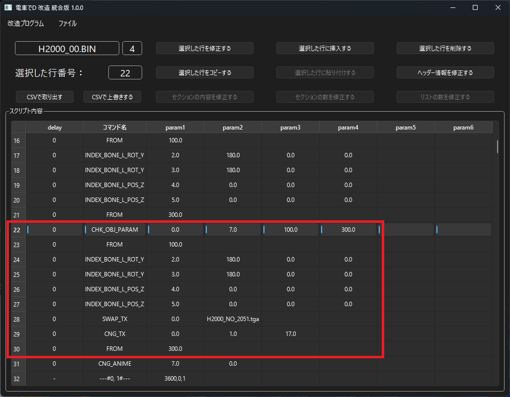
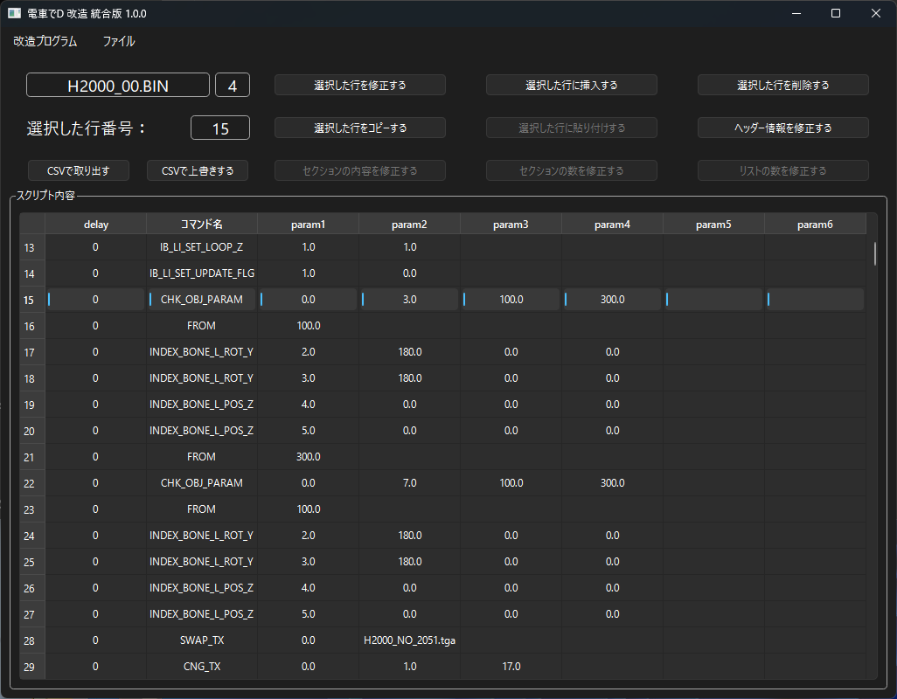
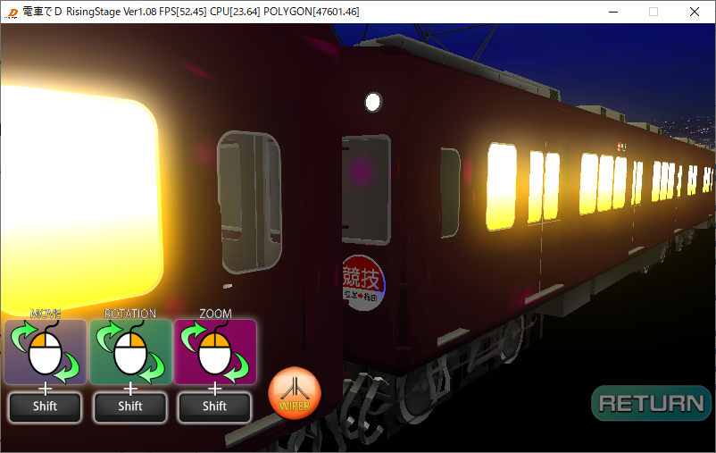
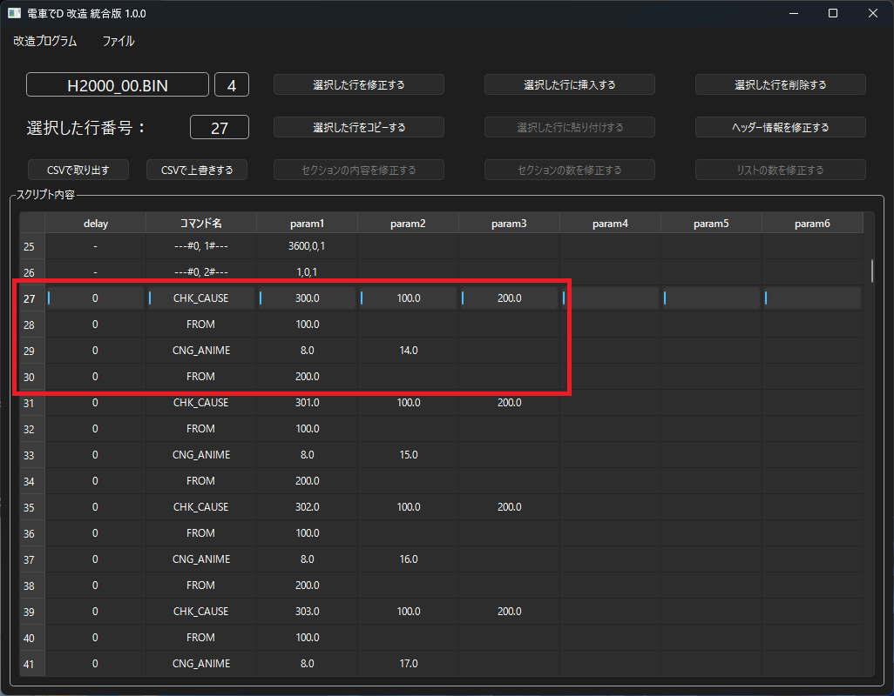
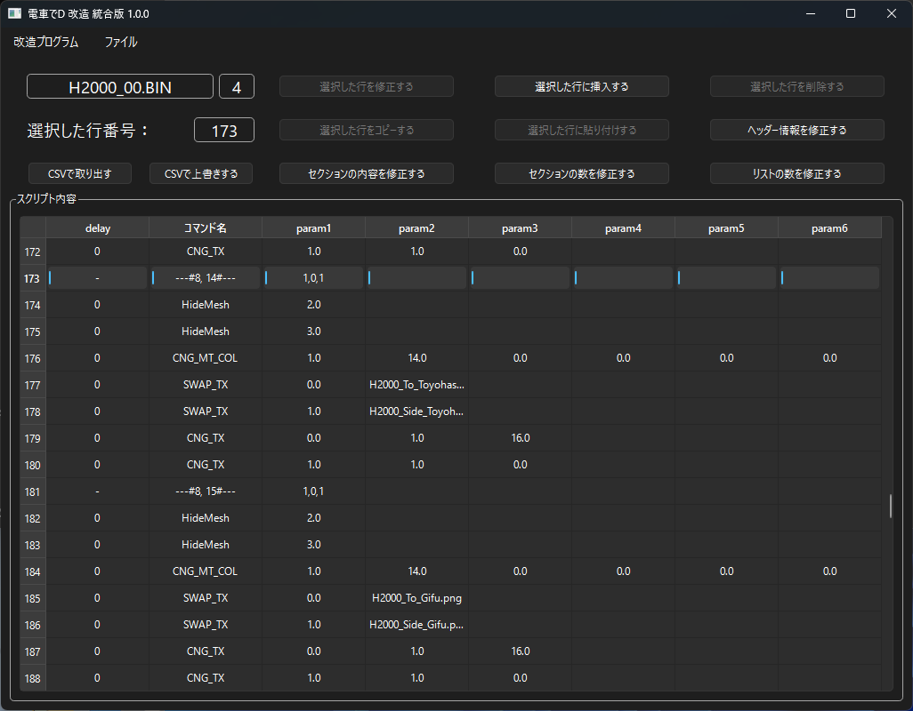

*[日本語](README.md)*

# Model Binary

For an explanation of binaries related to things other than train cars, see [【here】](/program/sub/mdlBin/mdlBin.md).

## How to run

1. Open the specified BIN file using "Open File" in the menu.

    The binary file follows the format 【ModelName_Number.BIN】.

    Example: H2000_00.BIN, H2800_00.BIN, MU2000_0.BIN...

    Make sure to do this in a location where the program can write.

2. Select a line in the script contents.

    This binary file's structure consists of 10 lists in total,

    and each list is further divided.

    The separator format is 【---#9, 9#---】 (hereafter referred to as 9-9).

3. Selecting a separator line activates the "Modify section count", "Modify section contents",

    and "Modify list count" buttons.

    The "Modify section count" button lets you modify the number of lists based on the current separator.

    The "Modify list count" button lets you increase or decrease the separators themselves.

4. Selecting a command line lets you modify, insert, delete, or copy this command.

    A copied command can be inserted within a section.

5. The "Modify header info" button lets you modify information such as images contained in the header.

6. This program saves immediately the moment you make a modification to a command or separator.

### FAQ

* Q. I have the Densha de D game, but the specified BIN file isn't there.

  * A. You can get it by extracting the Pack file with an archiver such as GARbro.

  * A. If you extract with GARbro using an empty password, the file becomes invalid, so make sure to enter the correct password.

* Q. Even when I specify the BIN file, I get told "This is not a Densha de D file, or the file may be corrupted."

  * A. Perhaps the extraction method is wrong, or the password used during extraction is wrong? It's best to redo the extraction process.

* Q. Even after modifying the BIN file, nothing changes?

  * A. If the existing Pack file and folder exist at the same time, the Pack file may be taking priority when loading.

    To prevent it from being loaded, either modify or delete the extracted Pack file.

* Q. Downloads are blocked, execution is blocked, or it's removed by security software

  * A. Since the software isn't signed, some browsers will block the download.

  * A. For the same reason, security software may also refuse to run it.

## Model frame functions (estimated)

| Frame | Function (estimated) |
| --- | --- |
| 0-0 | Initial processing |
| 0-1 | Unknown details (compressor value?) |
| 0-2 | ANIME setting for the destination sign based on the course |
| 0-3 | The ANIME destination roll sign for the Hankyu 2800 series used on the CS |
| 1-0 | START_WIPER processing |
| 1-1 | STOP_WIPER processing |
| 2-0 ~ 2-2 | JR2000 SMOKE generation processing |
| 3-0 ~ 3-8 | JR2000 SMOKE movement processing |
| 4-0 ~ 4-1 | JR2000 SMOKE_B generation/movement processing |
| 5-0 ~ 5-1 | JR2000 gas turbine generation processing (1P and 2P) |
| 6-0 ~ 6-1 | JR2000 gas turbine generation processing (1P and 2P) |
| 7-0 | Light processing for the initial direction (including push-pull operation) |
| 7-1 | Light processing for the reversed direction (including push-pull operation) |
| 8-0 ~ 8-18 | Reference for how destination sign files are inserted |
| 9-0 | Car number processing during switchback |
| 9-1 | Car number processing for the initial direction |
| 9-2 | Interior light setting during blind attack |
| 9-3 | Interior light setting when blind attack is released |
| 9-4 | Processing when the deadheading command (SET_KAISO) is set |
| 9-5 | Processing when the deadheading command (SET_KAISO) is released |
| 9-6 | Destination sign/light setting when turning off lights with SET_FOR |
| 9-7 | Destination sign/light setting when turning on lights with SET_FOR |
| 10-0 | Behavior when changing color on the train selection screen |
| 11-0 | Processing for a tilting train when the tilt has finally returned to level |
| 11-1 | Processing for a tilting train when it has finally tilted to the right |
| 11-2 | Processing for a tilting train when it has finally tilted to the left |

## How to modify the model binary

### Modifying wiper movement

The frames that determine wiper movement are 0-0, 1-0, and 1-1.

In MDL_GETINDEX, "WL" is the model of the left wiper.

IB_LI_CREATE_ROT_Z creates the animation index,

and IB_LI_SET_ROT_Z sets the model index, animation index, bend angle, animation frame, and movement type.

With IB_LI_SET_UPDATE_FLG and IB_LI_SET_LOOP_Z set to the initial value 0,

the animation index loop is stopped.

1-0 defines the behavior for when the wipers are moved via the Comic Script.

Set IB_LI_SET_UPDATE_FLG and IB_LI_SET_LOOP_Z to 1 to move them.

1-1 defines the behavior for when the wipers are stopped via the Comic Script.

Set IB_LI_SET_LOOP_Z to 0 to stop them.

### Rotating the model 180 degrees

The model's rotation is handled in the 0-0 frame.

In CHK_OBJ_PARAM, when the index is 7 (the 8th car),

it moves to FROM 100 and rotates 180 degrees with the command.

When the index is not 7, it moves to FROM 300.

Applying this, the image below shows a binary where the 4th and 8th cars of the Hankyu 2000 series have been rotated 180 degrees.

※ Be sure to also modify the model index arrangement in

  　"TRAIN_DATA3RD.BIN" for Climax Stage,

  　or "TRAIN_DATA4TH.BIN" for Rising Stage.

Applied image

### Increasing or decreasing the train set

This requires adjusting CHK_OBJ_PARAM,

which is defined in frames such as 0-0, 7-0, 7-1, 9-0, and 9-1.

In particular, when decreasing the train set, specifying an index that doesn't exist will crash the game.

### How to set the destination sign

The destination sign is set in the 0-2 frame.

The CHK_CAUSE command compares the selected course name,

and if it matches, moves to the 2nd FROM line; if not, it moves to the 3rd FROM line.

Then, CHG_ANIME sets the destination sign for the specified frame.

Example: For 300 (Meitetsu Nagoya Main Line), it changes to the destination sign set in 8-14.

Relationship between course list and numbers

| Number | Map name |
| --- | --- |
| 200 | Kobe Electric Railway Arima/Sanda Line |
| 201 | Hankyu Kobe Line |
| 202 | Keikyu Main Line |
| 203 | Kintetsu Nara Line |
| 204 | Nankai Airport Line |
| 299 | Climax Stage OP |
| 300 | Meitetsu Nagoya Main Line |
| 301 | Meitetsu Airport Line, Tokoname Line |
| 302 | Tobu Isesaki/Nikko Line (Downhill) |
| 303 | Tobu Isesaki/Nikko Line (Hill Climb) |
| 304 | Tobu Tojo Line |
| 399 | Rising Stage OP |

### How destination sign files are inserted

Destination sign files are saved within list 8.

For the earlier example, 8-14 for the Meitetsu Nagoya Main Line,

SWAP_TX specifies the destination sign files (H2000_To_Toyohashi.png, H2000_Side_Toyohashi.png).

These image files need to be placed in the Pack's MDL folder.

If there's nothing in the list, any file can be inserted,

but it's believed to be arranged according to the following pattern.

| List | Destination sign |
| --- | --- |
| 8-0 | Default sign (often Takarazuka → Umeda) |
| 8-1 | Keishin Sanjo → Hamaotsu |
| 8-2 | Unused (estimated: Hankyu Kyoto Line) |
| 8-3 | Unused (estimated: Keihan Main Line) |
| 8-4 | Unused (estimated: Kintetsu Osaka Line Hill Climb) |
| 8-5 | Unused (estimated: Kintetsu Osaka Line Downhill) |
| 8-6 | Deadheading |
| 8-7 | Unused (estimated: Hankyu Kobe Line) |
| 8-8 | Shinkaichi → Sanda |
| 8-9 | Sanda → Shinkaichi |
| 8-10 | Keikyu Kurihama → Shinagawa |
| 8-11 | Kintetsu Nara → Namba |
| 8-12 | Black sign |
| 8-13 | Sannomiya → Umeda |
| 8-14 | Gifu → Toyohashi |
| 8-15 | Chubu Centrair International Airport → Gifu |
| 8-16 | Kinugawa Onsen → Asakusa |
| 8-17 | Asakusa → Tobu Nikko |
| 8-18 | Ikebukuro ⇔ Arashiyama Signal Station |

### Deadheading sign

This is a guess, but when done via the SET_KAISO command script command,

it's likely handled in the 9-4 frame.

However, note that the way the deadheading sign changes can differ depending on the model.

That's all.
