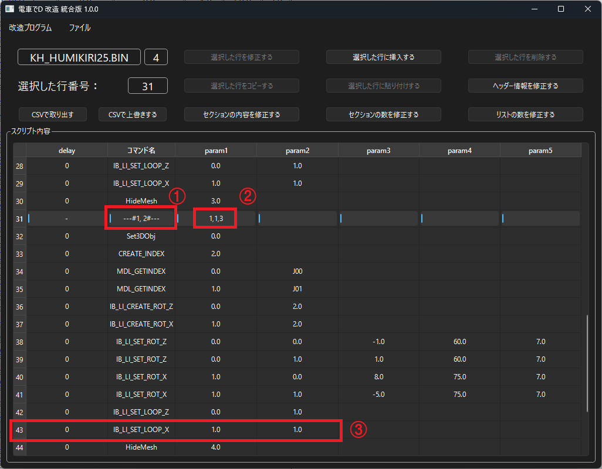
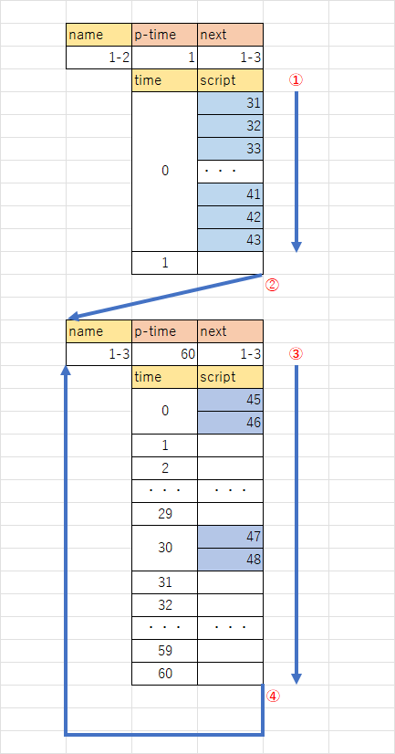
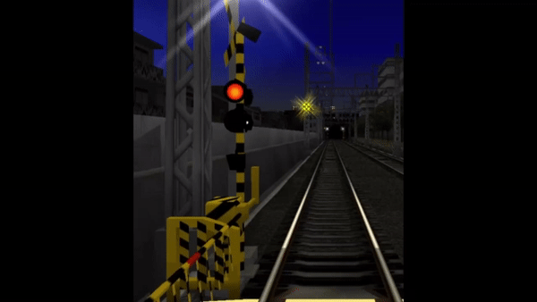

*[日本語](mdlBin.md)*

# Model Binary (non-train)

## Binary functions (estimated)

### ① Binary execution frame

The index of the binary frame currently being executed.

### ② Time / next binary frame to execute

Executes within the parameter's time, then executes the next binary frame.

Basically, model binaries are designed on the assumption that they run in an infinite loop.

### ③ Script

Executes the specified script at the delay's time.

## Example: Execution steps for the 1-2 frame

1. The time is "1", and the next binary frame to execute is "1-3".

2. When the time is 0 (executed immediately), scripts 31 through 43 are executed in order.

   However, if the delay's time is greater than the parameter's time,

   the lines from that point on are ignored, and it proceeds to the next binary frame.

3. Moves to the next binary frame, "1-3".

4. The time for "1-3" is "60", and the next binary frame to execute is "1-3".

5. When the time is 0 (executed immediately), scripts 45 through 46 are executed in order.

6. Waits 30 frames, then executes scripts 47 through 48 in order.

7. Moves to the next binary frame, "1-3" (repeats from here on).

## Animation result

1-2 is the railroad crossing barrier,

and 1-3 is the flashing light animation.
