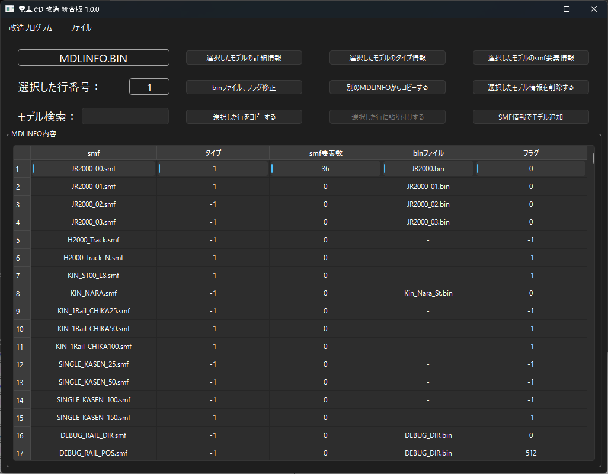
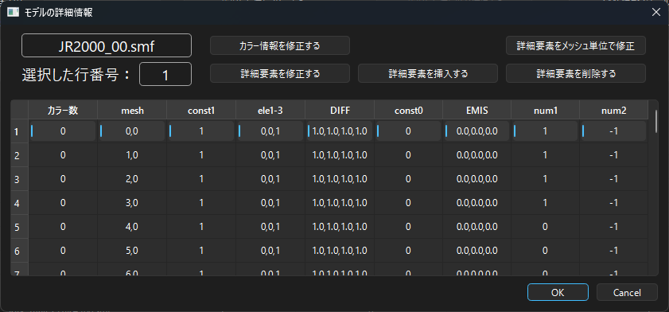
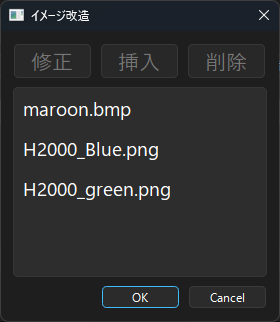
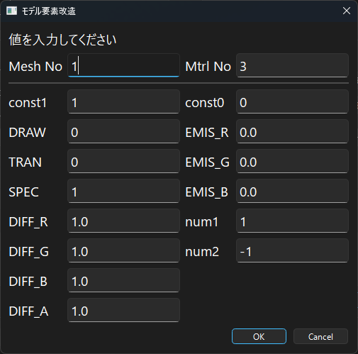
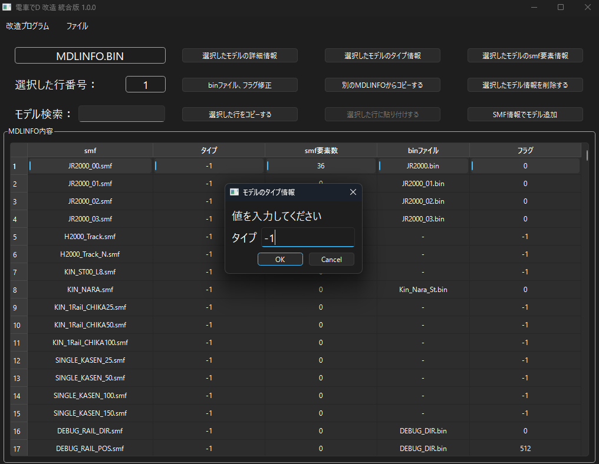
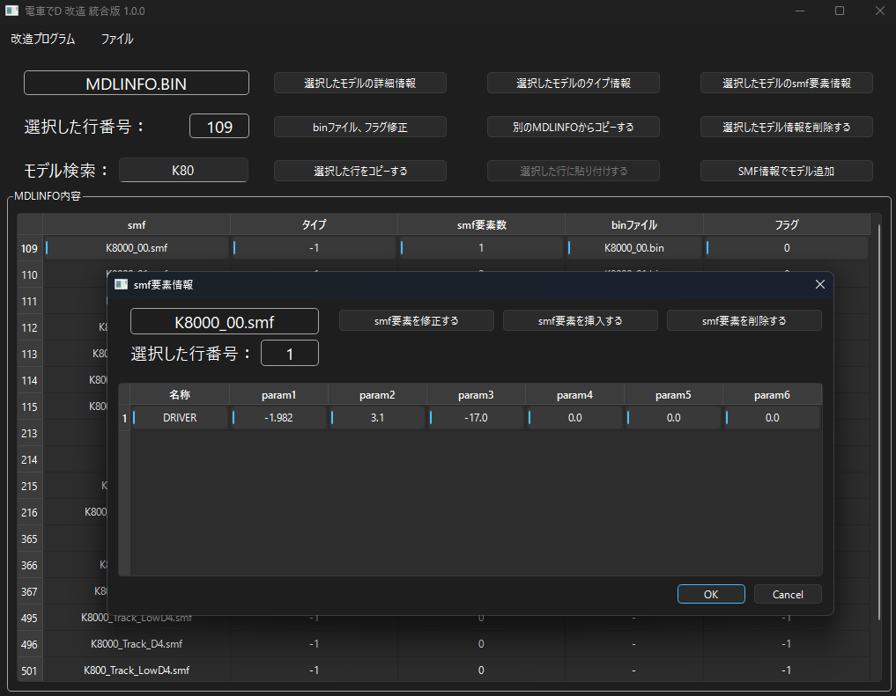
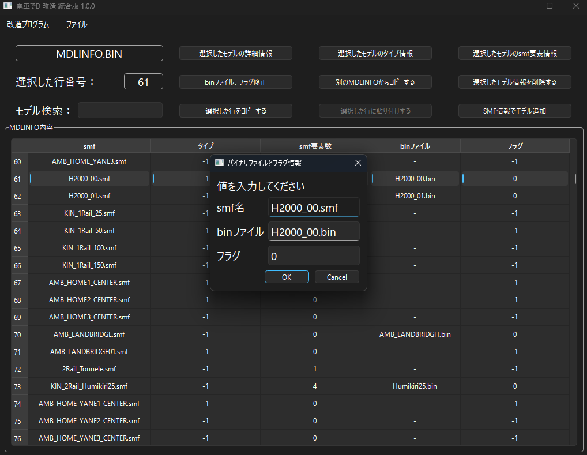
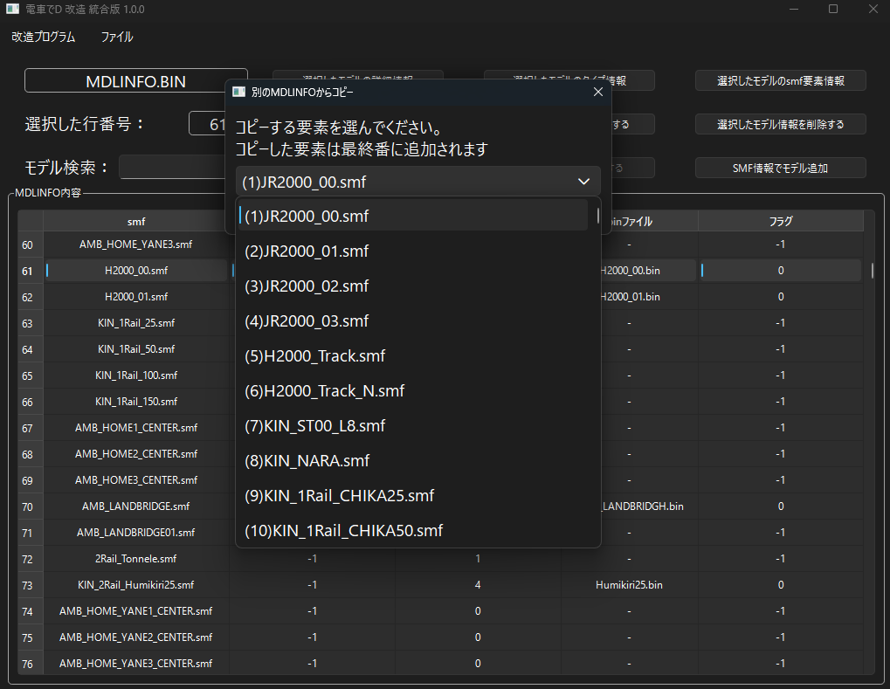

*[日本語](README.md)*

# MDLINFO

## How to Run

Open the specified BIN file via "Open File" in the menu.

Be sure to do this in a location where the program can write.

### Model Search

Entering a word automatically narrows down and displays the list.

### Editing Model Elements

1. Use the "Modify Color Info" button to modify the saved color (image information).

2. Use the "Modify Detail Elements" button to modify the following information.

* DRAW: Material draw setting. Setting this to 1 also allows manipulating the Alpha value.

* TRAN: Transparency setting, when the Alpha value can be manipulated. Setting this to 0 makes it fully transparent; 1 makes it semi-transparent.

* SEPC: Specular reflection setting. Setting this to 1 makes the material appear to reflect light.

* DIFF: The material's color.

* EMIS: The self-illumination color.

### Editing Model Type [Estimated]

Allows editing the model's type.

### Editing SMF Elements

Allows editing the elements defined in the SMF.

### Editing the bin File and Flags

Allows editing the model name, model binary file, and flags.

### Copying Model Info from Another MDLINFO

Opens another MDLINFO file and copies the model information defined there

into the file currently being edited.

Note that it is always added at the very end.

### Delete Model Info

Deletes model information. Once deleted, it cannot be undone.

### Copy Selected Row

Copies the model information of the selected row.

### Paste at Selected Row

Pastes model information into the selected row.

### Add Model from SMF Info

Adds mesh information using the selected SMF model.

Default values are entered, so there is no guarantee it will always work correctly.

### FAQ

* Q. I have the Densha de D game, but the specified BIN file doesn't exist.  

  * A. You can obtain it by extracting the Pack file with an archiver such as GARbro.

  * A. If you extract with GARbro using a blank password, you'll get an invalid file, so enter the correct password.

* Q. Even when I specify the BIN file, I'm told "This is not a Densha de D file, or the file may be corrupted."

  * A. The extraction method might be wrong, or the password used during extraction might be wrong. You should redo the extraction process.

* Q. I modified the BIN file, but nothing changed?

  * A. If the original Pack file and its extracted folder both exist at the same time, the Pack file may be taking priority when loading.

    To keep it from being loaded, modify or delete the extracted Pack file.

* Q. The download gets blocked, execution gets blocked, or my security software deletes it.

  * A. Since the software isn't code-signed, some browsers may block the download.

  * A. For the same reason, security software may also refuse to let it run.

That's all.
