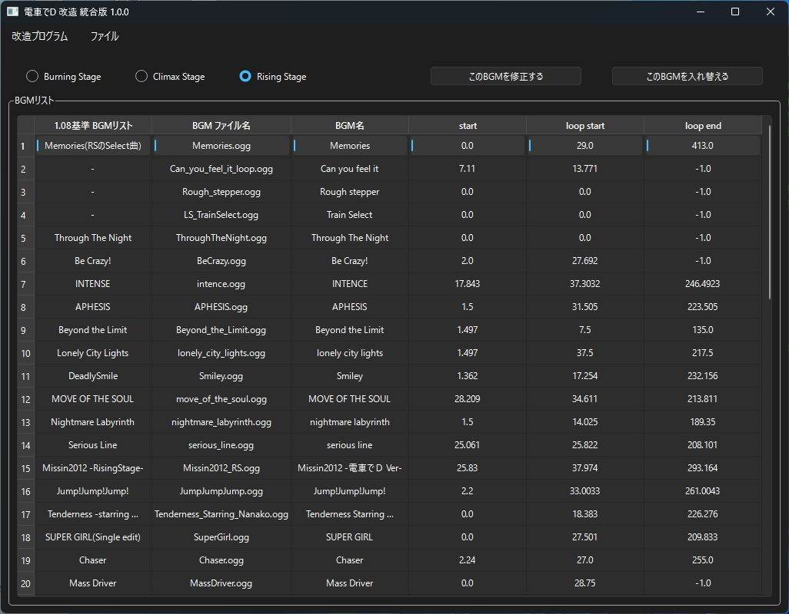

*[日本語](README.md)*

# BGM List

## How to Run

### How to Edit the BGM List

1. Open the binary file via "Open File" in the menu.

    For Burning Stage, open "LS_INFO.BIN".

    For Climax Stage, open "SOUNDTRACK_INFO.BIN".

    For Rising Stage, open "SOUNDTRACK_INFO_4TH.BIN".

    Be sure to do this in a location where the program can write.

2. Select the row you want to edit.

3. Use the "Modify This BGM" button to modify the BGM file name or duration.

4. Use the "Swap This BGM" button to swap it with another row in the list.

### FAQ

* Q. I have the Densha de D game, but the specified binary file doesn't exist. 
  
  * A. For older titles up through Rising Stage, you can obtain it by extracting the Pack file

    with an archiver such as GARbro.

  * A. If you extract with GARbro using a blank password, you'll get an invalid file, so enter the correct password.

* Q. Even when I specify the BIN file, I'm told "An unexpected error occurred. This is not a Densha de D file, or the file may be corrupted."

  * A. The extraction method might be wrong, or the password used during extraction might be wrong. You should redo the extraction process.

* Q. I modified the BIN file, but nothing changed?

  * A. For older titles up through Rising Stage, if the original Pack file and its extracted folder both exist at the same time,

    the Pack file may be taking priority when loading.

    To keep it from being loaded, modify or delete the extracted Pack file.

* Q. The download gets blocked, execution gets blocked, or my security software deletes it.

  * A. Since the software isn't code-signed, some browsers may block the download.

  * A. For the same reason, security software may also refuse to let it run.

That's all.
