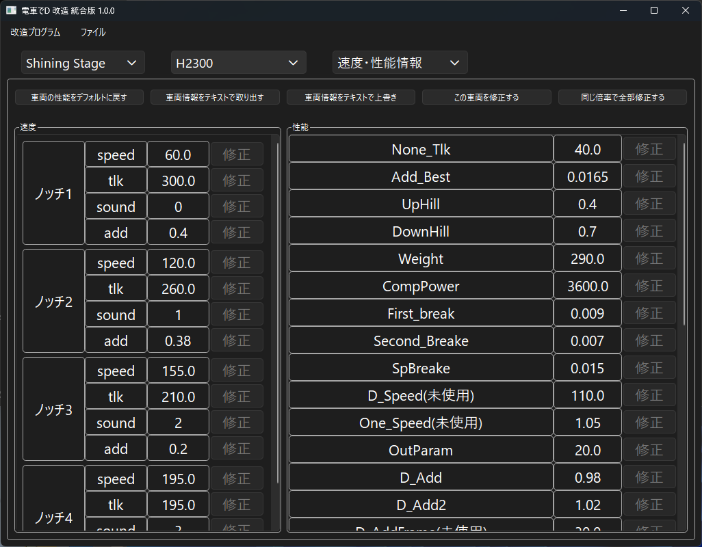
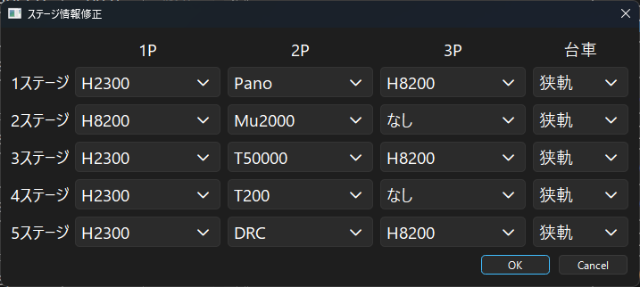
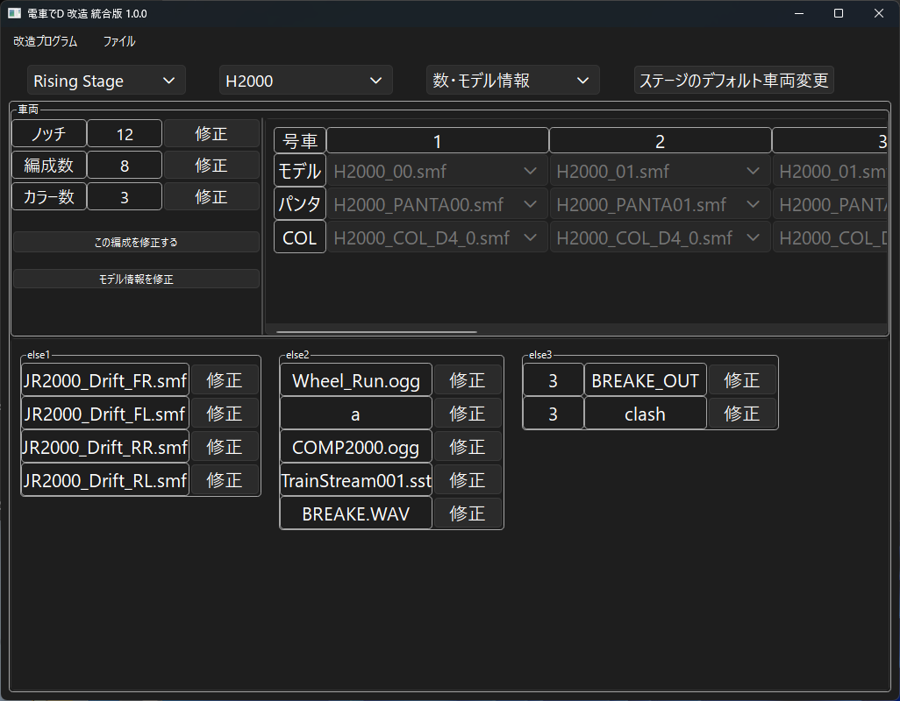
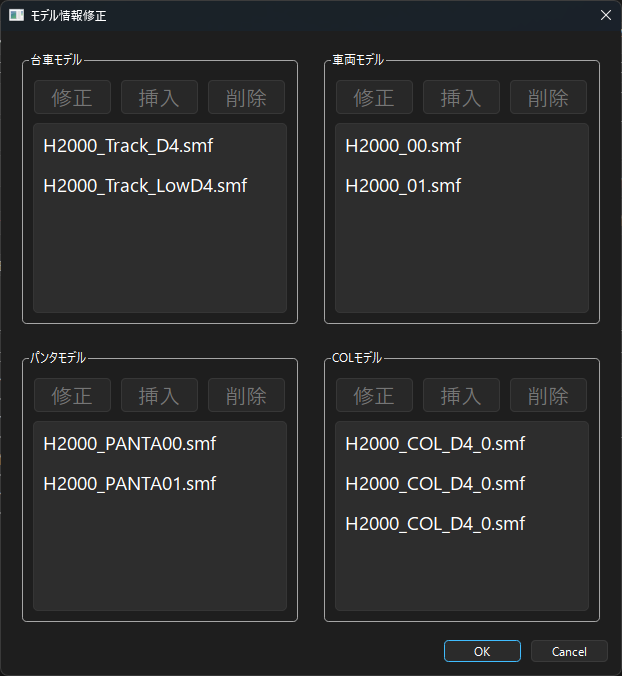
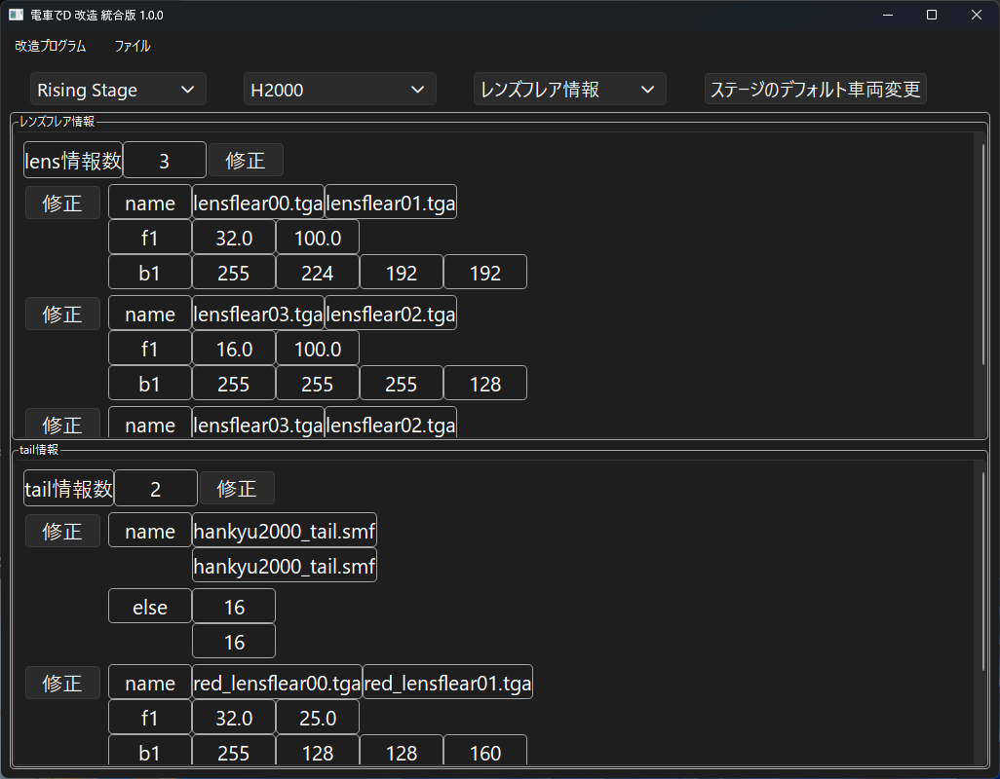
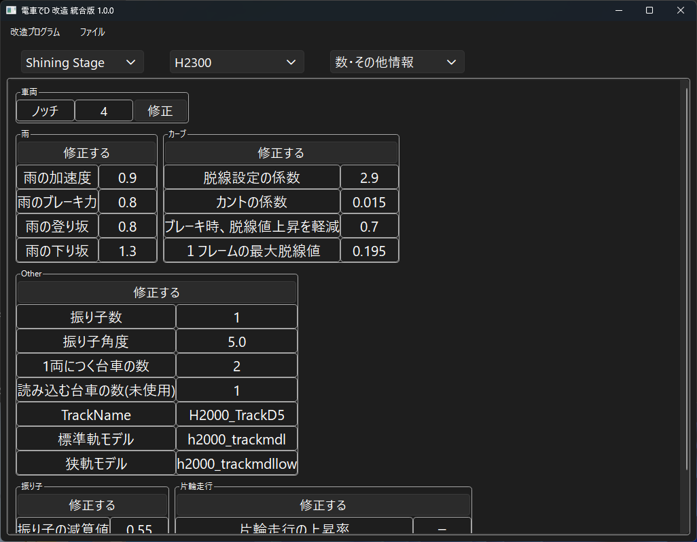

*[日本語](README.md)*

# Train Modification

## How to Run

1. Select the game from the dropdown. The initial state is "Shining Stage".

2. Open the BIN file via "Open File" in the menu.

    For Lightning Stage, it's "TRAIN_DATA.BIN"

    For Burning Stage, it's "TRAIN_DATA2ND.BIN"

    For Climax Stage, it's "TRAIN_DATA3RD.BIN"

    For Rising Stage, open "TRAIN_DATA4TH.BIN".

    For Shining Stage, open "train_org_data.den".

    Be sure to do this in a location where the program can write.

3. Select a train from the list.

4. Select the item you want to modify. You can choose from "Speed/Performance Info", "Count/Model Info", and "Lens Flare".

    For Shining Stage, you can choose from "Speed/Performance Info" and "Count/Other Info".

## How to Change Stage Info

*Only available for Lightning Stage, Burning Stage, Climax Stage, and Rising Stage.

*For Lightning Stage, load the executable (.exe) file.

1. You can change the train applied by default when a stage is selected.

2. From Climax Stage onward, you can also set the bogie.

3. Clicking OK saves immediately.

## How to Change Speed/Performance

1. The "Reset train performance to default" button resets all speed or performance values to their default numbers.

2. The "Extract train info as CSV" button outputs the train info as CSV.

    This extracts all info except some "else" entries.

    For Shining Stage, the "Extract train info as text" button

    outputs the stored text as-is.

3. The "Overwrite train info with CSV" button lets you modify the train info.

    This overwrites and modifies all info except some "else" entries.

    For Shining Stage, the "Overwrite train info with text" button

    overwrites and stores the text.

4. The "Modify this train" button activates the speed/performance modification controls.

    While modifying, you cannot select a different train.

5. The "Save" button saves the modified speed or performance.

6. The "Modify all by the same ratio" button lets you modify

    a given performance value across all trains by x times or by an x value.

7. When a value is modified, it turns red if higher than default, and blue if lower.

## (Older Titles) How to Change Count/Model Info

1. The train frame lets you set the number of train sets and colors, and the model, pantograph, and COL applied to each set.

2. Changing the notch also changes the info in the speed frame.

    If you increase the notches, the added ones default to 0.

3. Changing the number of train sets also changes the set info for each train on the right.

4. For the color count, in files from CS onward, only the number can be changed.

    LS has no color count and is not supported, and BS can only be modified via CSV.

5. The "Modify this set" button lets you modify the set info for each train on the right.

6. The "Save" button saves the set info for each train on the right

7. The "Modify model info" button lets you change the configured model info

    This function is only available for CS and RS.

8. You can also modify other "else" info, among other things.

## (Older Titles) How to Change Model Info

*Only available for Climax Stage and Rising Stage.

1. Click "Modify model info" in the train frame to do this.

2. Click the list box to Modify, Insert, or Delete.

    However, the configured model, pantograph, and COL cannot be deleted.

3. Clicking OK updates the model info set for each train.

## (Older Titles) How to Change Lens Flare Info

1. You can modify the lens flare info and the tail lamp info

## How to Change Count/Other Info

1. You can modify train-related performance other than the notch/performance info

### FAQ

* Q. I have a Densha de D game, but the specified BIN file isn't there.  
  
  * A. Lightning Stage is DenD_Data102.Pack,

    Burning Stage is Pach006_ALL.Pack,

    Climax Stage is Patch004.Pack,

    Rising Stage is Patch_4th_4;

    extract it with an archiver such as GARbro to obtain it.
  * A. If you extract using GARbro with an empty password, the file will be invalid, so enter the correct password.

* Q. Even when I specify the BIN file, it says "This may not be a Densha de D file, or the file may be corrupted."

  * A. Perhaps the extraction method was wrong, or the password used during extraction was wrong? You should redo the process.

* Q. Even after modifying the BIN file, nothing changes?

  * A. If the existing Pack file and the folder both exist at the same time, the Pack file may be prioritized and loaded instead.

    To prevent it from being loaded, rename or delete the extracted Pack file.

* Q. The download is blocked, execution is blocked, or security software deletes it

  * A. Since it isn't software-signed, some browsers may block the download
  * A. For the same reason, security software may also refuse to run it.

* Q. When I tried extending the number of train sets, it caused an error

  * A. Since the train is constructed by calculating backward from the stage's initial placement position,

    if there isn't enough rail space behind it, an error occurs.

    Also, Lightning Stage and Burning Stage can theoretically be extended infinitely, but

    for Climax Stage, P1 can extend up to a maximum of 8 cars,

    and for Rising Stage, P1 can extend up to a maximum of 10 cars.

    P2 (CPU only) can theoretically be extended infinitely.

That's all.