*[日本語](README.md)*

# Rail Editor

## How to Run

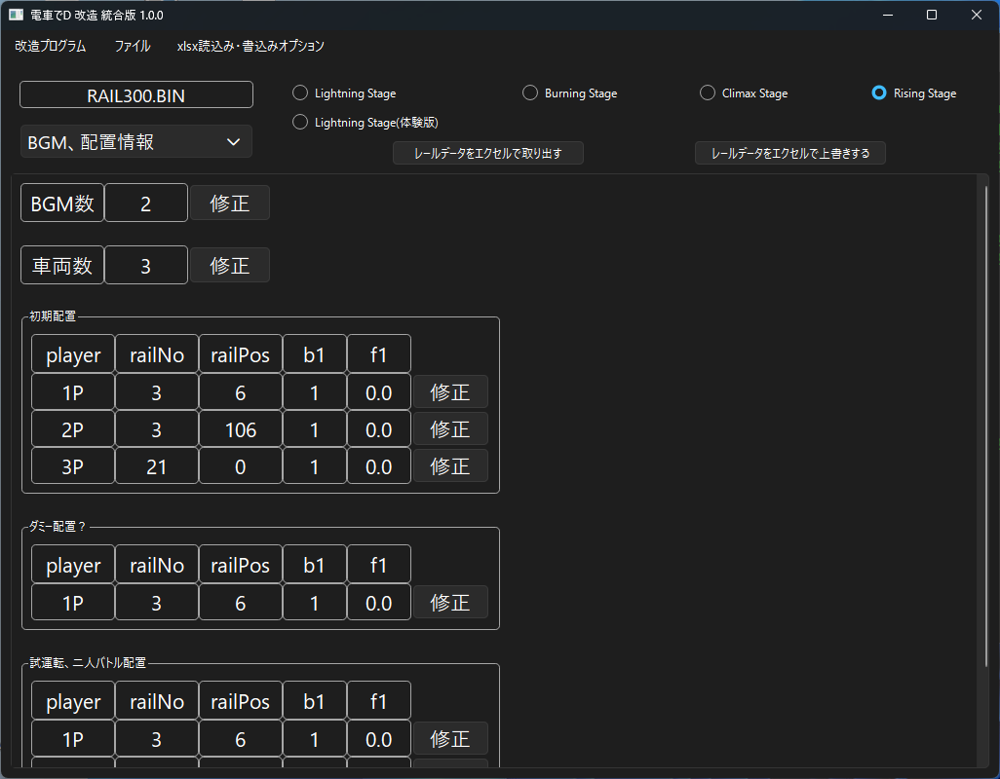

Open the specified BIN file using "Open File" in the menu.

Make sure to do this in a location where the program can write files.

You will be able to modify information contained in the rail binary.

You can also extract the rail data in Excel and overwrite it from there.

LS trial version files can also be loaded, but the explanation of elements is omitted here.

### BGM, Placement Info

You can adjust the number of BGMs, the number of cars that appear,

and each of their initial placement positions.

 * Number of BGMs

   LS: Always 1. Defines the details of the BGM to play during battle. However, there is no loopEnd element. 
   BS: A holdover from earlier titles. Modifying this has no effect; you need to modify the LS_INFO.bin file instead. 
   CS, RS: Only defines the "number of BGMs" loaded for the stage.

 * Number of Cars

   LS: Defines the number of cars to load. However, it does not define which cars are loaded. 
   BS, CS, RS: Defines the number of cars loaded in Story Mode. This also changes the number of initial placements.

 * Initial Position

   Defines which rail a car loaded in Story Mode is placed on. 
   This placement is based on the frontmost bogie of the lead car, and should account for train sets that are longer, since running out of space causes a crash.

 * Dummy Placement?

   Dummy data. Modifying it has no effect.

 * Practice / 2-Player Battle Placement

   Defines which rail a car loaded in Practice Run or 2-Player Battle is placed on.

 * Initial Station Display No

   Defines, by index number, which station the station display in the upper right starts showing from.

 * (BS only) "Dummy Placement? and Initial Station Display No"

   Modifying these has no effect.

### Element 1

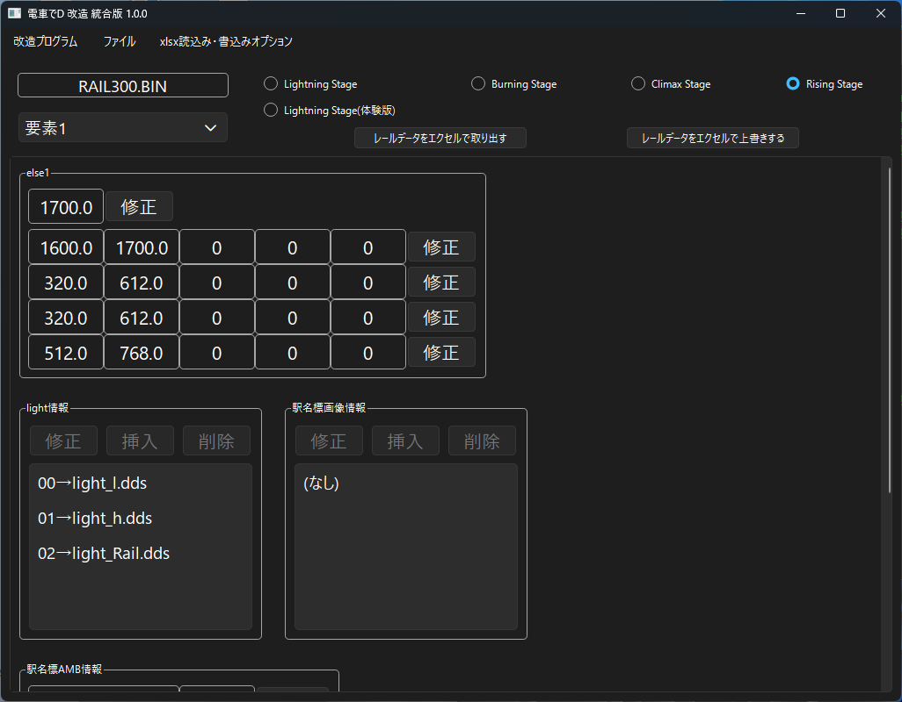

You can adjust the night view and background, dds and station sign definitions, and bin file animations.

 * else1

   Believed to relate to the stage's sky / sky color. The exact spec is unknown.

 * Light Info (BS, CS, RS)

   Directx9 dds file info loaded by the Densha de D game engine.

 * Station Sign Image Info (CS, RS)

   Image file info for custom station signs.

 * Station Sign AMB Info (CS, RS)

   1. const0: Details unknown 
   2. AMB Number: The AMB's index number 
   3. AMB Child Number: The AMB's child number. Counting from -1 determines the model. 
   4. ele: Details unknown 
   5. Image Number: The index number of the image defined in Station Sign Image Info

 * Base bin Info (BS, CS, RS)

   bin file info used to apply ANIME.

 * Base bin ANIME

   Number of ANIME: Determines the number of ANIME applied on the stage 
   1. const1: [Presumed] Index 1 of Base bin Info. For LS this is fixed at 1, using "SCENE3DOBJ.BIN". 
   2. param1: ANIME number 1 defined in the bin file 
   3. param2: ANIME number 2 defined in the bin file

### smf Info

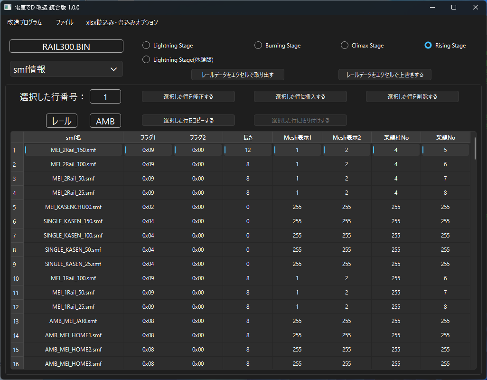

You can adjust the list of smf files used on the stage.

 * For LS

   No. 0: The index number of the smf to load 
   No. 1 smf Name: Defines the smf file name to load 
   No. 2 Length: Defines the number of bones in the smf. Some models don't have this. 
   No. 3 e1: [Presumed] Defines the Mesh to display by index. If 255, all are displayed. 
   No. 4 List Count: Defines the ANIME effects applied to the smf model.

   * "Modify List of Selected Row"

     No. 1: ANIME number 1 defined in the bin file 
     No. 2: ANIME number 2 defined in the bin file 

     Applies the ANIME effect from "SCENE3DOBJ.BIN" at the position predefined in the smf. 
     This ANIME effect is almost always a railroad crossing around the model.

 * For BS

   No. 0: The index number of the smf to load 
   No. 1 smf Name: Defines the smf file name to load 
   No. 2 Length: Defines the number of bones in the smf. Some models don't have this. 
   No. 3 Mesh Display 1: [Presumed] Defines the Mesh to display by index. If 255, all are displayed. 
   No. 4 Mesh Display 2: [Presumed] Defines the Mesh to display by index. If 255, all are displayed. 
   No. 5 List Count: Defines the ANIME effects applied to the smf model.

   * "Modify List of Selected Row"

     No. 1: Bone position of the model (rail) 
     No. 2: ANIME number 1 defined in the bin file 
     No. 3: ANIME number 2 defined in the bin file 

     Applies the ANIME effect at the specified bone position of the smf. 
     This ANIME effect is almost always a railroad crossing around the model.

 * For CS, RS

   No. 0: The index number of the smf to load 
   No. 1 smf Name: Defines the smf file name to load 
   No. 2 Flag 1: Assigns the model's default attributes 
   No. 3 Flag 2: Applies restrictions such as what happens when colliding with the model 
   No. 4 Length: Defines the number of bones in the smf. Some models don't have this. 
   No. 5 Mesh Display 1: [Presumed] Defines the Mesh to display by index. If 255, all are displayed. 
   No. 6 Mesh Display 2: [Presumed] Defines the Mesh to display by index. If 255, all are displayed. 
   No. 7 Overhead Wire Pole No: Index number of the overhead wire pole model applied by default 
   No. 8 Overhead Wire No: Index number of the overhead wire model applied by default

### Station Name Position Info

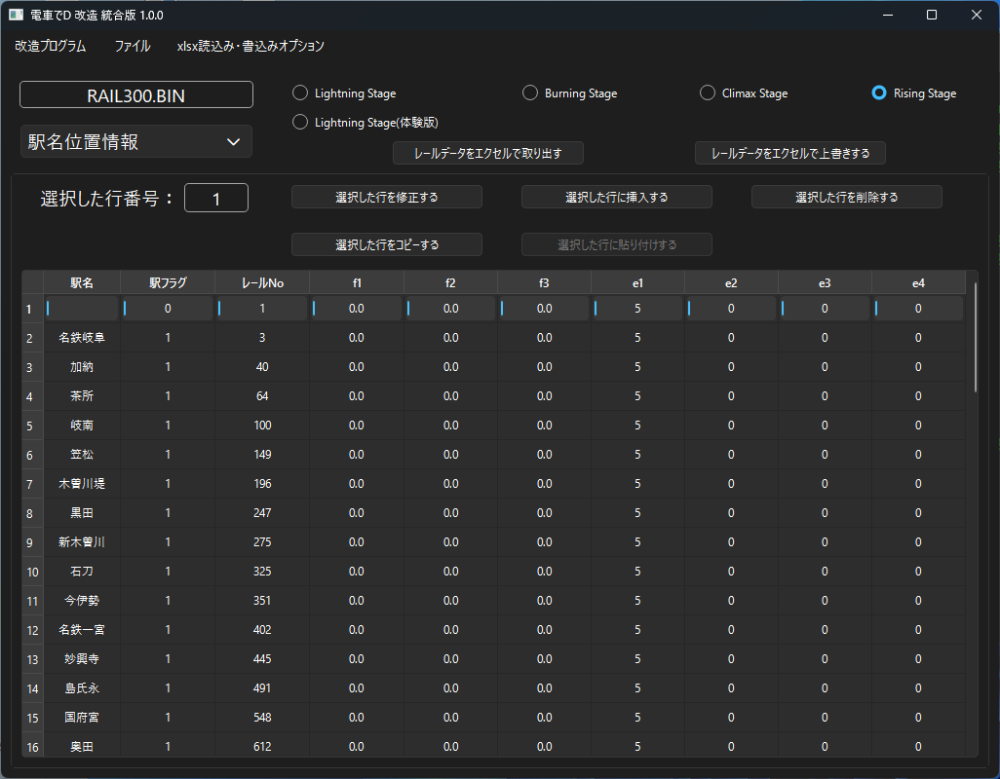

You can adjust where the station name shown in the upper right of the game is displayed.

 * For LS

   No. 0: Index number of the station name 
   No. 1 Station Name: Defines the station name 
   No. 2 Station Flag: Defines the attribute 
     * Types of station flags 
       0 (Start) 
       1 (Default) 
       2 (Goal): Used for goal detection

   No. 3 Rail No: Defines which rail it is displayed on 
   No. 4-9: Details unknown

 * For BS

   No. 0: Index number of the station name 
   No. 1 Station Name: Defines the station name 
   No. 2 Station Flag: Defines the attribute 
     * Types of station flags 
       0 (Start) 
       1 (Default) 
       2 (Goal): Used for goal detection 
       3 (Save): Enables Quick Save

   No. 3 Rail No: Defines which rail it is displayed on

 * For CS, RS

   No. 0: Index number of the station name 
   No. 1 Station Name: Defines the station name. 
   　In CS, if the "Station Name Hide Workaround" option is turned ON, this is not reflected. 
   　From RS onward, station names became fully image-based, so modifying this has no effect. 
   No. 2 Station Flag: Defines the attribute 
     * Types of station flags 
       0 (Start) 
       1 (Default) 
       2 (Goal): Used for goal detection

   No. 3 Rail No: Defines which rail it is displayed on 
   No. 4-10: Details unknown

### Element 2

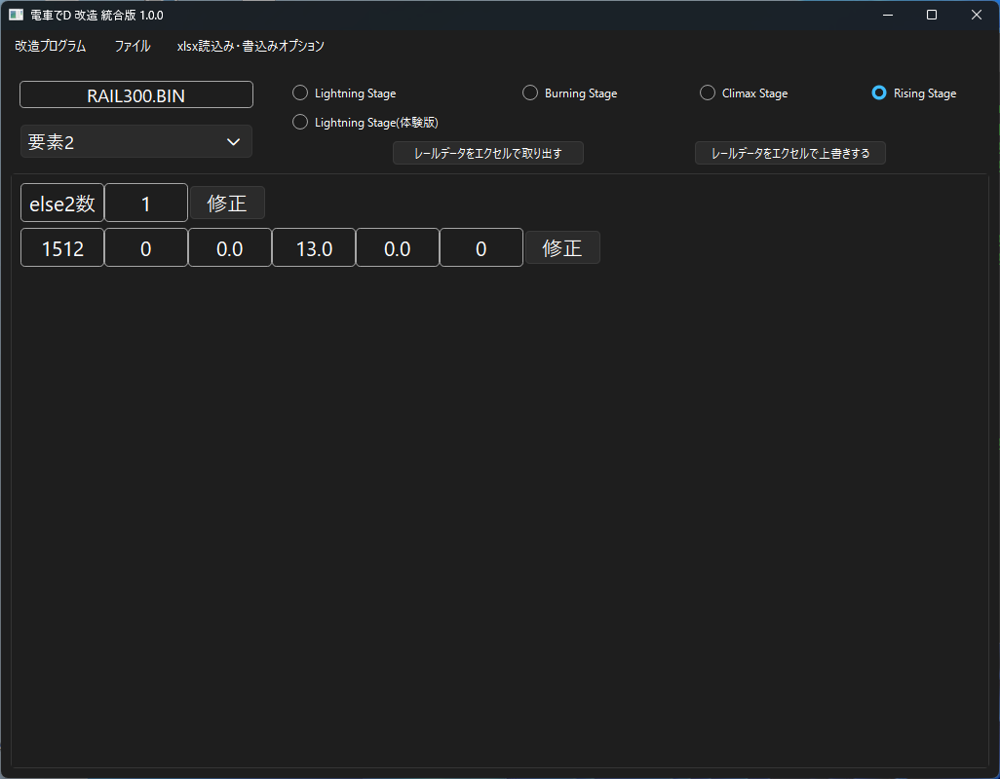

Unknown.

### CPU Info

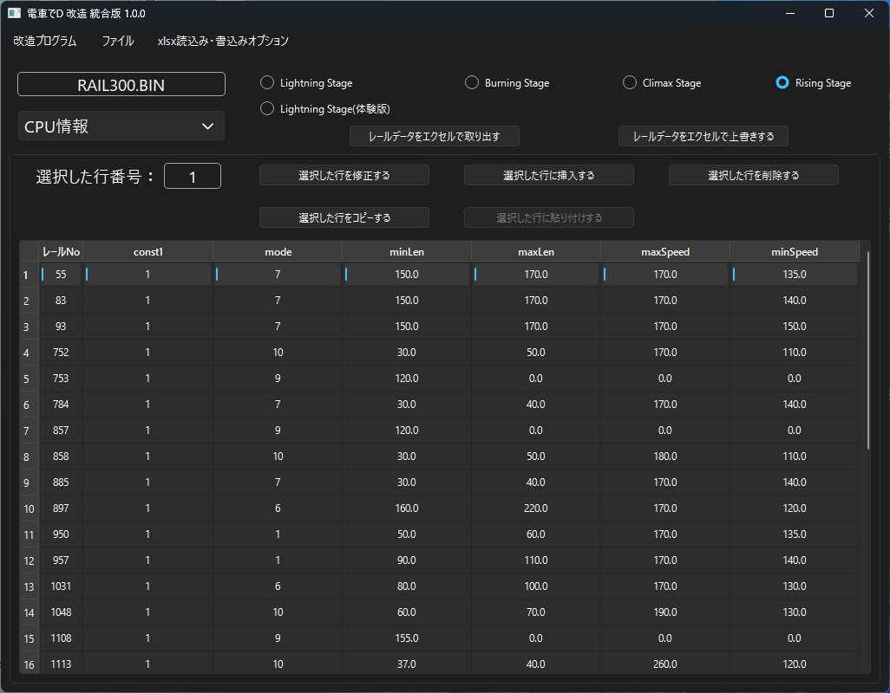

You can adjust CPU speed based on rail position.

 * For LS

   No. 0: Index number of the cpu entry 
   No. 1 Rail No: Defines which rail the cpu mode applies to 
   No. 2 list1: Details unknown 
   No. 3 const1: Refers to cpu (1). 
   No. 4 mode: Sets the cpu mode. For a detailed explanation of the modes, see [【here】](https://khttemp.github.io/dendData/comicscript/cpuMode/cpuMode.html) 
   No. 5 minLen: Sets the cpu's "minimum distance" 
   No. 6 maxLen: Sets the cpu's "maximum distance" 
   No. 7 maxSpeed: Sets the cpu's "maximum speed" 
   No. 8 minSpeed: Sets the cpu's "minimum speed" 
   No. 9 defSpeed: Sets the cpu's "default speed" 
   No. 10 list2: Details unknown

 * For BS

   No. 0: Index number of the cpu entry 
   No. 1 Rail No: Defines which rail the cpu mode applies to 
   No. 2 const1: Refers to cpu (1). 
   No. 3 mode: Sets the cpu mode. For a detailed explanation of the modes, see [【here】](https://khttemp.github.io/dendData/comicscript/cpuMode/cpuMode.html) 
   No. 4 minLen: Sets the cpu's "minimum distance" 
   No. 5 maxLen: Sets the cpu's "maximum distance" 
   No. 6 maxSpeed: Sets the cpu's "maximum speed" 
   No. 7 minSpeed: Sets the cpu's "minimum speed"

 * For CS

   No. 0: Index number of the cpu entry 
   No. 1 Rail No: Defines which rail the cpu mode applies to 
   No. 2 const1: Refers to cpu (1). 
   No. 3 mode: Sets the cpu mode. For a detailed explanation of the modes, see [【here】](https://khttemp.github.io/dendData/comicscript/cpuMode/cpuMode.html) 
   No. 4 minLen: Sets the cpu's "minimum distance" 
   No. 5 maxLen: Sets the cpu's "maximum distance" 
   No. 6 maxSpeed: Sets the cpu's "maximum speed" 
   No. 7 minSpeed: Sets the cpu's "minimum speed" 
   No. 8 defSpeed: Sets the cpu's "default speed"

 * For RS

   No. 0: Index number of the cpu entry 
   No. 1 Rail No: Defines which rail the cpu mode applies to 
   No. 2 const1: Refers to cpu (1). 
   No. 3 mode: Sets the cpu mode. For a detailed explanation of the modes, see [【here】](https://khttemp.github.io/dendData/comicscript/cpuMode/cpuMode.html) 
   No. 4 minLen: Sets the cpu's "minimum distance" 
   No. 5 maxLen: Sets the cpu's "maximum distance" 
   No. 6 maxSpeed: Sets the cpu's "maximum speed" 
   No. 7 minSpeed: Sets the cpu's "minimum speed"

### Comic Script, Dosan Line

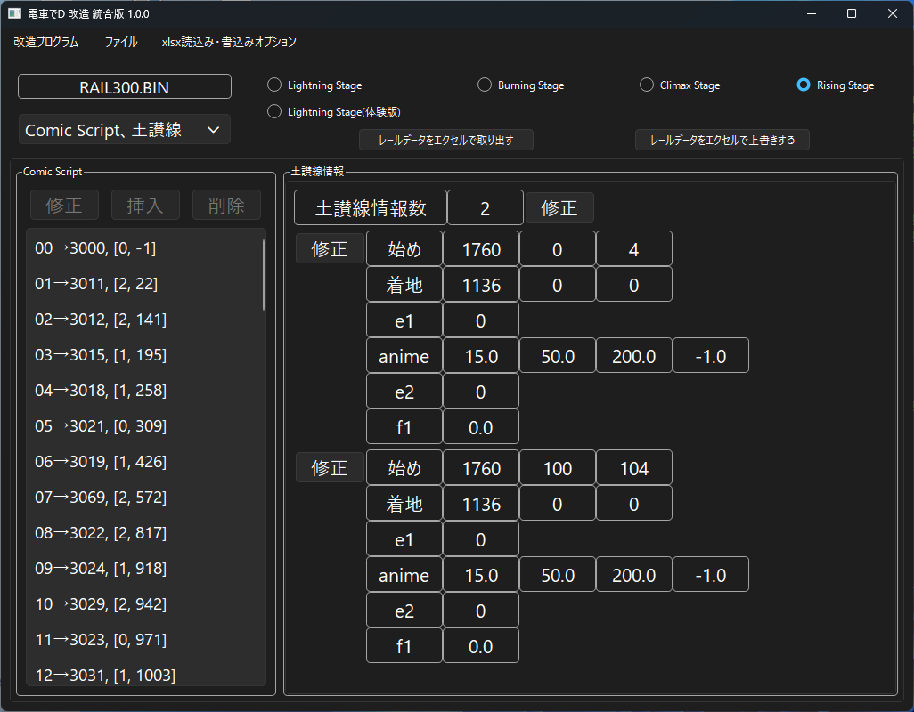

Defines the Comic Script used on the stage.

For CS, RS, you can adjust the Dosan Line special line.

 * Comic Script

   Regardless of Story, Battle, or Practice Run mode,

   the script defined first, in order, is always loaded.

   No. 1 Comic Number: Defines the number of the Comic Script to load, e.g. "comic3000.bin" 
   No. 2 Event Type: Defines the event type that triggers the script 
     * Types of event types 
       0 (Player) 
       　Normally a Story-only script. 
       　Runs automatically, based on the player, when the set rail is reached. 
       　Setting the rail position to "-1" prevents it from running automatically, for use when calling it via "GOTO_SCRIPT". 
       1 (CPU) 
       　A Story-only script. 
       　Runs automatically, based on the CPU, when the set rail is reached. 
       2 (Fast) 
       　A Story-only script. 
       　Runs automatically when either the Player or CPU reaches the set rail. 
       3 (Goal) 
       　A script usable in Story, Practice Run, or Battle. 
       　Used for things like determining on which rail the goal is placed. 
       　Normally the rail position is "-1", and it runs at the same time as type 4. 
       　In CS, RS, "comic2990.bin" is commonly used. 
       4 (GoalEvent) 
       　A Story-only script. Used from BS onward. 
       　The script that runs when a Goal event occurs in Story and the goal is reached. 
       　Normally the rail position is "-1", and it runs at the same time as type 3. 
       5 (Event) 
       　A script meant to run simultaneously with others. Used from BS onward. 
       　Whichever script comes first, in order, is loaded first. 

   No. 3 Rail Position: Defines the rail position where the script is triggered

 * Dosan Line Info (CS, RS)

   This info only defines the section where the Dosan Line can be created; if performing a Dosan Line jump via command input,

   it must also be defined separately in the rail data's flags.

   1. Start 
   　The section where the Dosan Line jump can begin. 
   　Defines, in order, "Rail No, start bone No, end bone No". 
   2. Landing 
   　The section where you land after a Dosan Line jump. 
   　Defines, in order, "Rail No, start bone No, end bone No". 
   　The end bone No is believed to be unused data. 
   3-: Details unknown

### Rail Info

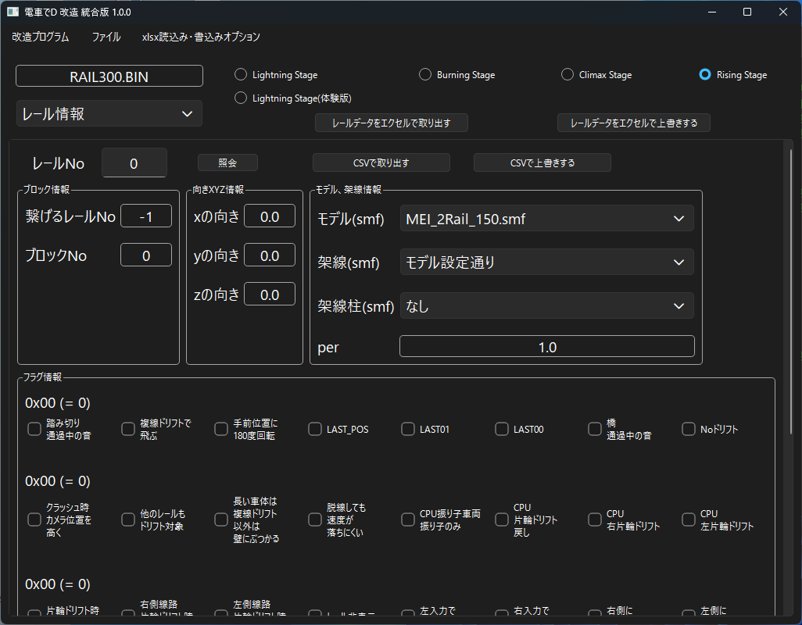

Lets you view the info for the actual rails run on in the stage.

To modify, use Excel or CSV to make adjustments.

For the elements of RS rail info, see [【here】](/program/sub/railEditor/raildata.md).

### Element 3 (Cam, for LS)

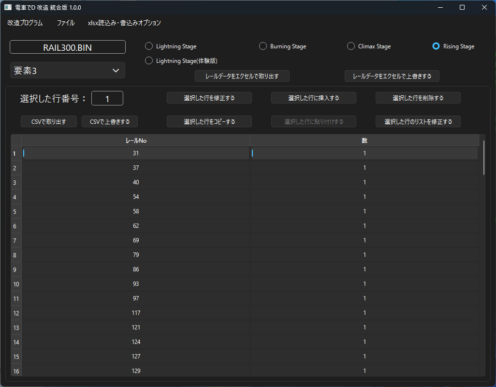

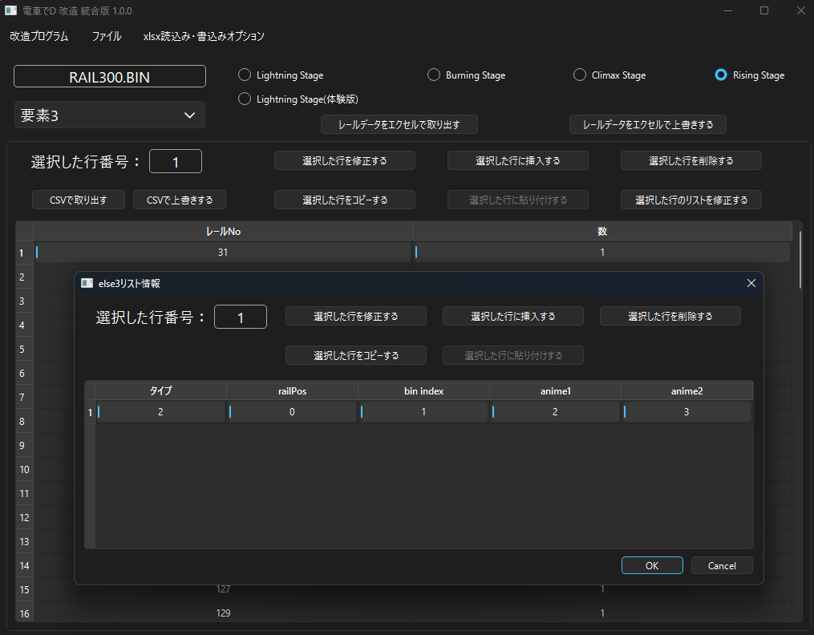

Places a model on the specified rail or overhead wire pole

and applies an ANIME effect.

 * For LS

   [Presumed] Applies a camera effect when the player passes a location specified by absolute coordinates.

   No. 0: Index number of the cam entry 
   No. 1 f1-f3: [Presumed] Absolute coordinates 
   No. 2 Count: The number of camera effects applied upon passing

   * Cam List

     No. 0: Index number of the Cam List entry 
     No. 1 f1-f3: [Presumed] Absolute coordinates 
     No. 2 f4: The frame at which the camera effect is applied 
     No. 3 b1: LS camera type

 * For BS, CS, RS

   No. 0: Index number of the Element 3 entry 
   No. 1 Rail No: Defines which rail it is applied on 
   No. 2 Count: The number of ANIME effects applied

   * Element 3 List

     No. 0: Index number of the Element 3 List entry 
     No. 1 Type: The location where the ANIME effect is applied 
       　0: [LS, BS only] Center of the model (smf specified directly) 
       　1: Rail 
       　2: Overhead wire pole 
       　6: Rail bone 
     No. 2 railPos
       　When Type is 1 or 2, the N position defined in the SMF. (e.g. specifying 2 places it at 【N2】)
       　When Type is 6, the rail bone 
     No. 3 bin index: Index of Base bin Info 
     No. 4 anime1: ANIME number 1 
     No. 5 anime2: ANIME number 2

### Element 4

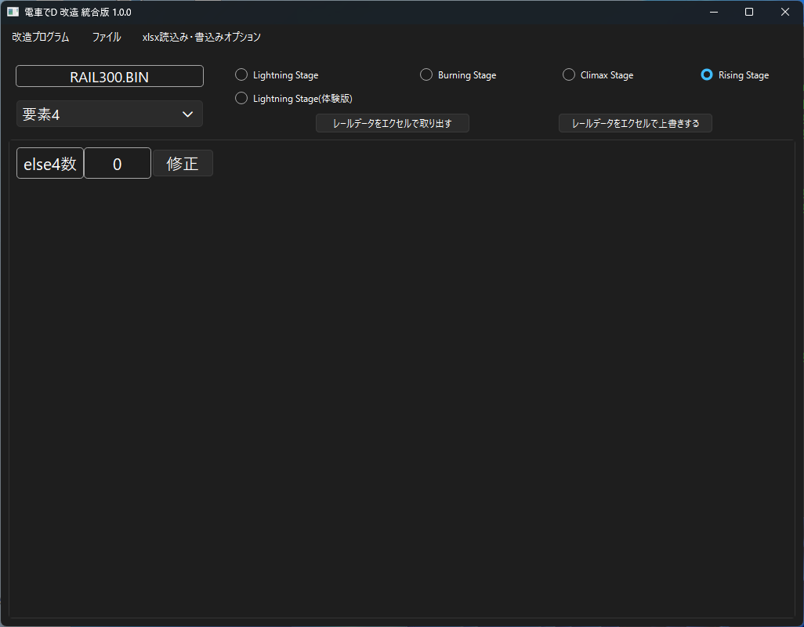

See [【here】](/program/sub/railEditor/raildata.md) for the link.

### AMB Info

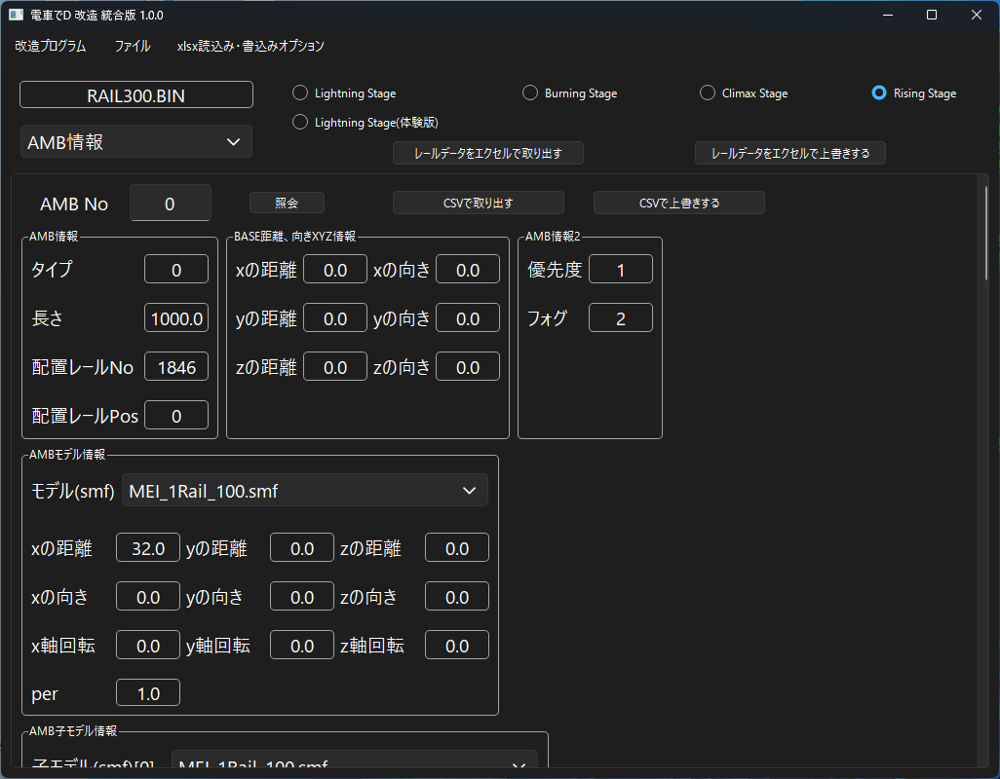

Lets you view the info for AMBs, which are treated as objects, used on the stage.

To modify, use Excel or CSV to make adjustments.

For the elements of RS AMB info, see [【here】](/program/sub/railEditor/ambdata.md).

 * For LS

   Can be thought of as "Element 3" from BS onward.

   No. 0: Index number of the AMB 
   No. 1 Rail No: Defines which rail it is applied on 
   No. 2 Type: The location where the ANIME effect is applied 
    　0: Center of the model (smf specified directly) 
    　1: Beside the rail 
    　2: Overhead wire pole 
    　6: Rail bone 
   No. 3 railPos: Bone of the specified rail 
   No. 4 anime1: ANIME number 1. For type 0, the smf's index number 
   No. 5 anime2: ANIME number 2. For type 0, fixed at 【-1】

 * For BS

   Unlike RS, there is no child model.

   It is defined only by XYZ translation and XYZ rotation relative to a given rail and bone position, plus PER.

 * For CS

   Same as RS

### xlsx Read/Write Options

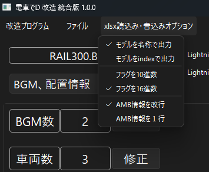

You can select options for extracting to and overwriting from Excel.

* Output models by name, or output by absolute index.

* Output/input flag elements in decimal, or in hexadecimal.

* Output/input AMB results either line-broken per AMB model info unit, or all on a single line.

### FAQ

* Q. I have the Densha de D game, but the specified BIN file doesn't exist.  

  * A. You can obtain it by extracting the Pack file with an archiver such as GARbro.

  * A. If you extract using GARbro with an empty password, the file becomes invalid, so make sure to enter the correct password.

* Q. Even when I specify the BIN file, I get told "This may not be a Densha de D file, or the file may be corrupted."

  * A. Perhaps the extraction method is wrong, or the extraction password is wrong? It's best to redo the extraction process.

* Q. I modified the BIN file but nothing changed?

  * A. If both the original Pack file and the folder exist at the same time, the Pack file may be taking priority when loading.

    To prevent it from being loaded, modify or delete the extracted Pack file.

* Q. The download is blocked, execution is blocked, or my security software deletes it.

  * A. Since the software isn't signed, some browsers may block the download.

  * A. For the same reason, security software may also refuse to run it.

That's all.
