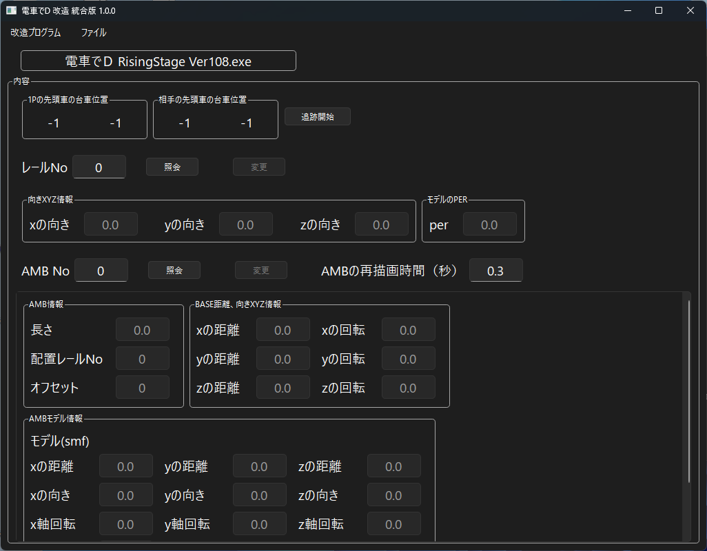

*[日本語](README.md)*

# RS Rail/AMB

## How to Run

In the menu's "Open File", open RisingStage's executable file.

Be sure to open the latest version, 1.08.

Also, since this works by reading and writing memory, run it with administrator privileges.

This is a feature for previewing rail and AMB placement in real time.

### Tracking Rail Position

The "Start Tracking" button displays the 1P and 2P rail positions in real time.

It changes to an "End Tracking" button; press it again to stop tracking.

### Modifying Rail Data

The only rail elements that can be modified are

dir_x, dir_y, dir_z, and per.

Since changes aren't reflected immediately after modification, or cause odd rendering,

you'll need to move back and forth so the display redraws.

### Modifying AMB

The only elements that can be modified are

length, rail_no, rail_pos,

base_pos_x,y,z / base_dir_x,y,z,

and, for both the parent AMB and child AMB,

pos_x,y,z / dir_x,y,z / dir2_x,y,z / per.

After modification, aside from the pos translation element,

changes aren't reflected immediately, or cause odd rendering,

so you'll need to move back and forth so the display redraws.

### FAQ

* Q. The download is blocked, execution is blocked, or my security software deletes it

  * A. Since the software isn't signed, some browsers may block the download.

  * A. For the same reason, some security software may refuse to let it run.

The end.
