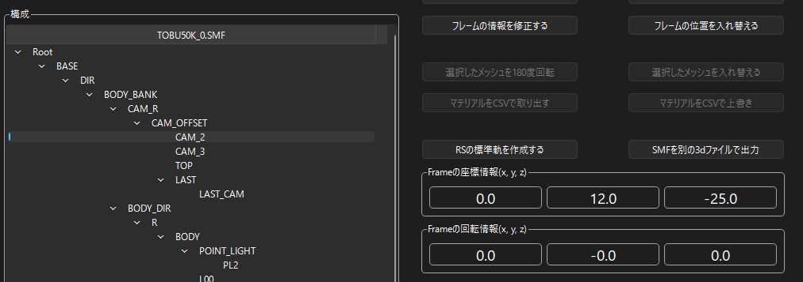
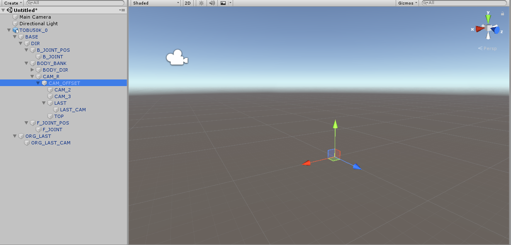
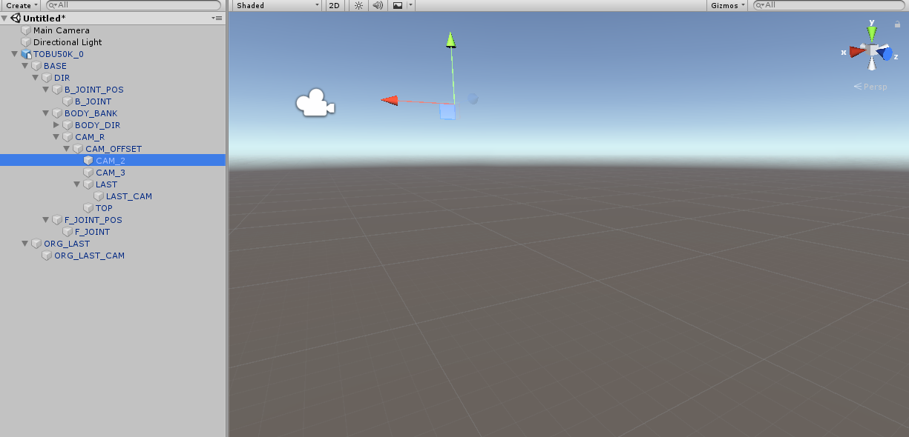
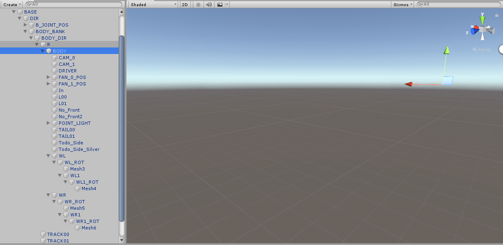
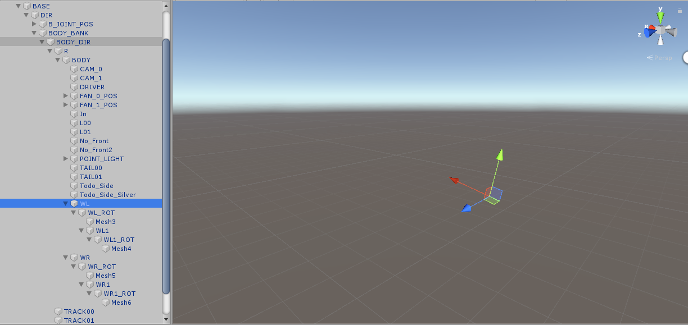
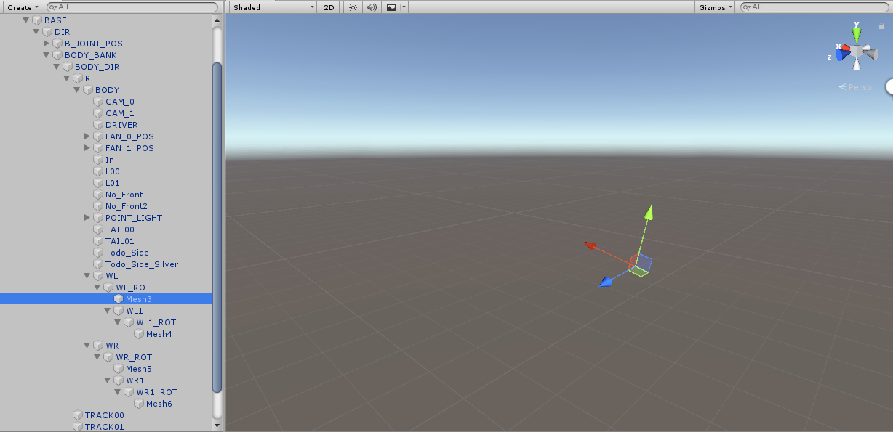
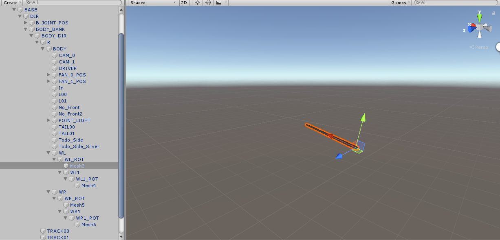
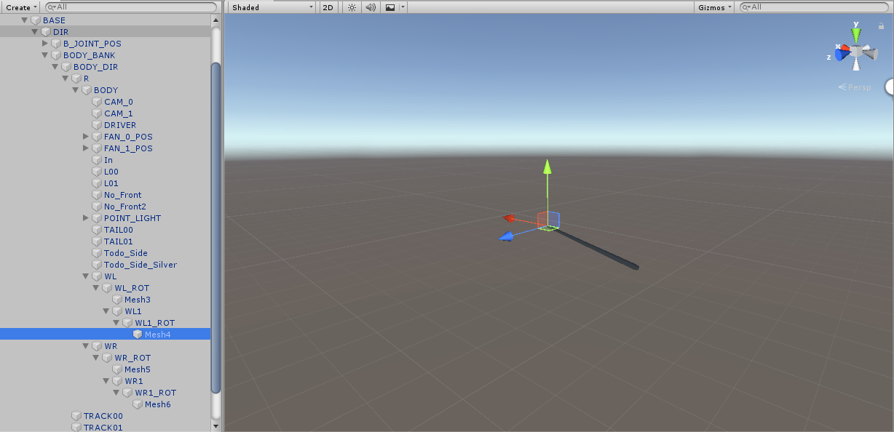
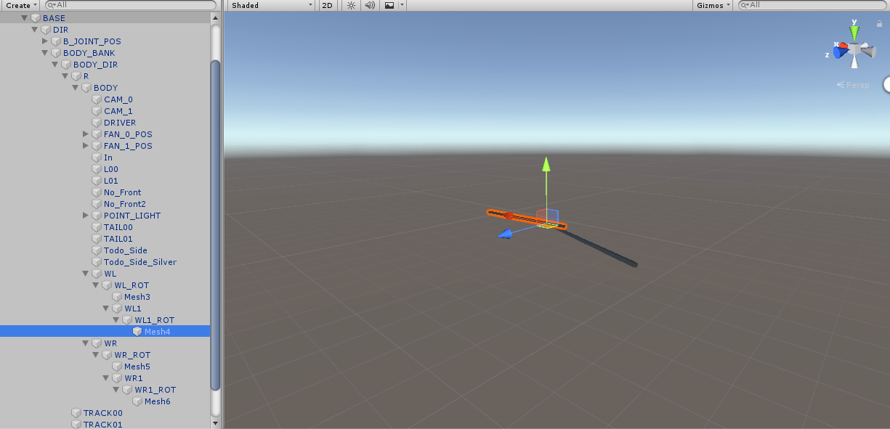

*[日本語](FRAME_MESH.md)*

# About frames and meshes

## What is a frame

The structure of each SMF frame is basically the same as Unity's FBX.

For example, the CAM_2 frame

is positioned roughly "(0, 12, -25)" away from its parent, CAM_OFFSET.

(The position of CAM_OFFSET reproduced in Unity)

(The position of CAM_2 reproduced in Unity)

## What is a mesh

Information that defines coordinates, the polygons formed by groups of three of those coordinates,

the normal info, UV info, materials, etc. of those polygons.

In short, this information is used to create the "visible model".

When a frame specifies a mesh,

that frame's position and rotation info becomes the origin for the mesh.

For example, the wiper mesh

first has BODY as the origin,

translates by roughly (-2.52296, -0.6191, 19.4661)

and rotates by roughly (0.0, -2.3, 12) to place the "WL" frame.

Next, with WL as the origin,

the control frame "WL_ROT"

and the mesh frame "Mesh3" are placed.

When you specify a mesh for the mesh frame,

it looks like this.

Likewise, with "WL_ROT" as the origin,

translate by roughly (1.22156, 0.0, -0.01291)

and rotate by roughly (0.0, 0.0, -12) to place the "WL1" frame.

Likewise,

the control frame "WL1_ROT"

and the mesh frame "Mesh4" are placed.

When you specify a mesh for the mesh frame,

it looks like this.
