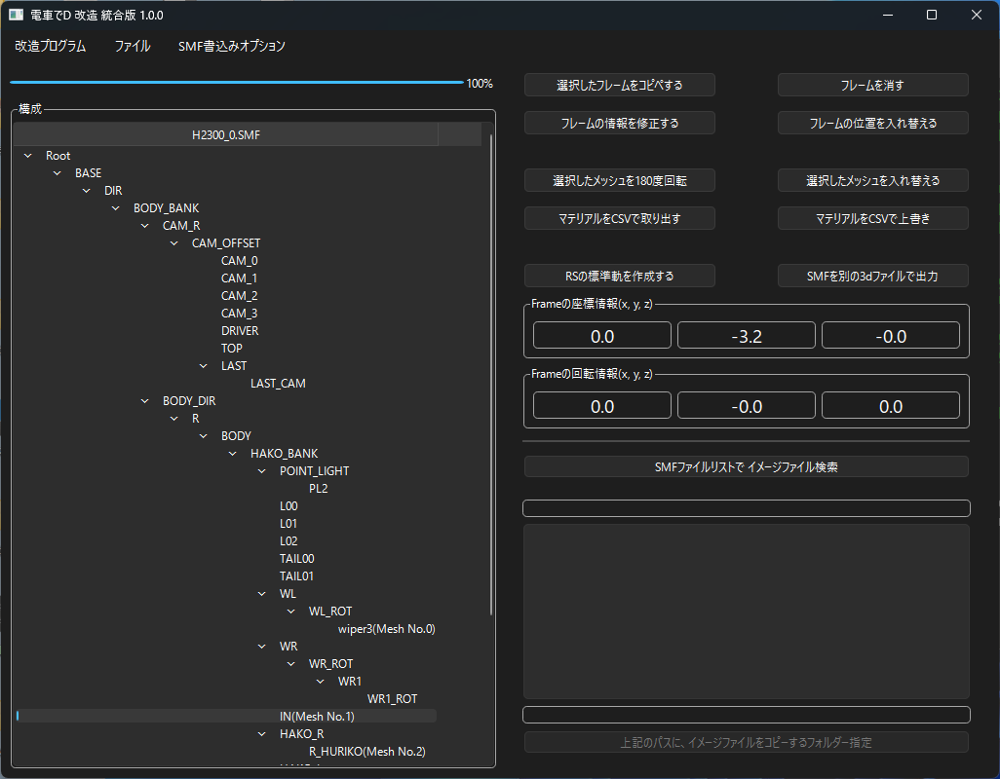

*[日本語](README.md)*

# SMF

## How to Run

In the menu's "Open File", open the specified SMF file.

Be sure to work in a location where the program has write access.

Currently, only the following functions are supported:

viewing the SMF's frame hierarchy, and

writing detailed information out to a text file.

## Frame-Related Functions

### Copy and paste the selected frame

Literally, copies and pastes the selected frame.

### Delete frame

Deletes the selected frame.

If a mesh is also specified, that mesh is deleted as well.

Note that this affects all child elements of the specified element.

### Modify frame info

You can modify the name, position info, and rotation info of the selected frame.

### Change the frame hierarchy

You can change the frame hierarchy using the mouse.

## Mesh-Related Functions

These functions are activated when you select a frame that specifies a mesh.

### Rotate the selected mesh 180 degrees

Rotates the mesh 180 degrees around the vertical axis (the game's Y axis).

### Swap the selected mesh

You can swap meshes.

If you load an SMF file, you can swap one of the meshes within the SMF's meshes.

If you load an FBX file, you can swap one of the recognized meshes.

### Extract material as CSV

You can extract a mesh's material info as CSV.

Only TEXC, DIFF, and EMIS info is extracted.

### Overwrite material with CSV

You can overwrite a mesh's material info with CSV.

Only TEXC, DIFF, and EMIS info can be overwritten.

## Other Functions

### Create standard gauge

Using the CS-only standard gauge model together with RS's narrow gauge model,

creates an RS-only standard gauge.

For details, see [the link here](STANDARD.md).

### Export SMF as another 3D file format

Currently, it can be exported in the following formats:

 * fbx file
 * glb file
 * x file

Note, however, that models exported as glb or x files

have no "bone elements".

Also, when exporting as glb with the "Embed Texture" option selected,

the texture is only embedded if it exists in the folder of the opened SMF file.

If it doesn't exist, it's converted to a file-reference type instead.

### Search for image files using an SMF file list

Analyzes the specified multiple SMF files and

checks whether the textures used by the SMF exist

in the folder containing the SMF.

### Specify a folder to copy image files into, based on the above path

Among the results analyzed by the SMF file list,

if there are textures that don't exist in the folder,

you can specify the folder containing the textures so they can be copied over.

### FAQ

* Q. I have the Densha de D game, but the specified SMF file is missing.

  * A. You can obtain it by extracting the Pack file with an archiver such as GARbro.

  * A. If you extract using GARbro with an empty password, you'll get an invalid file, so make sure to enter the correct password.

* Q. Even when I specify the SMF file, it says "This is not a Densha de D SMF, or the file may be corrupted."

  * A. The extraction method may be wrong, or the extraction password may be wrong. You should probably redo the extraction process.

* Q. I modified the SMF file, but nothing changed?

  * A. If an existing Pack file and folder exist at the same time, the Pack file may be prioritized when loading.

    To prevent it from being loaded, change or delete the extracted Pack file.

* Q. The download is blocked, execution is blocked, or my security software deletes it

  * A. Since the software isn't signed, some browsers may block the download.

  * A. For the same reason, some security software may refuse to let it run.

* Q. How do I port an SS FBX?

  * A. See the [link here](FBX.md).

The end.
