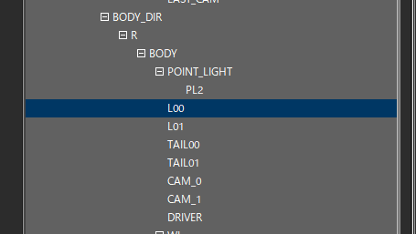
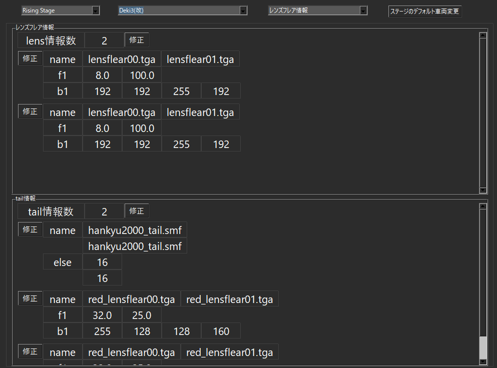

*[日本語](SMF_LIGHT_TAIL.md)*

# Adjusting Lighting

This section describes how to adjust the position of a car's lens flares and tail lights.

If you experience a game crash when selecting a car,

it may be caused by a mistake in these adjustments.

## Lens Flares, Tail Lights

Among the frames in the SMF's BODY,

frames starting with "L00~" are the positions of the lens flares used for things like headlights,

and frames starting with "TAIL00~" are the positions of the tail lights.

Adjusting the position of these frames

lets you adjust where the lens flares and tail lights light up.

## Lens Flares and Tail Lights in Train Performance

Using the lens flare info and tail light info

defined in Train Performance,

you can adjust the size of the light (believed to be f1)

and the color of the light (believed to be b1), among other things.

Because of this, the number of frames in the SMF should, as much as possible,

match the number of entries defined in Train Performance.

   

### If the lead car and the trailing car use different models, where is the tail light positioned?

This is speculation, but in this case,

it first lights up at the "L00~" position defined in the trailing car's model.

If there is no L00, or not enough of them, it lights up at the "TAIL00~" position instead.

### If the trailing car's SMF model has neither "L00~" nor "TAIL00~", where is the tail light positioned?

It likely lights up at whichever position among the loaded SMF's frames was read in internally,

but exactly how that position is chosen is unknown.
