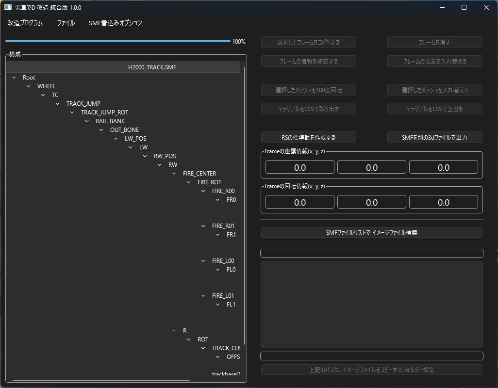
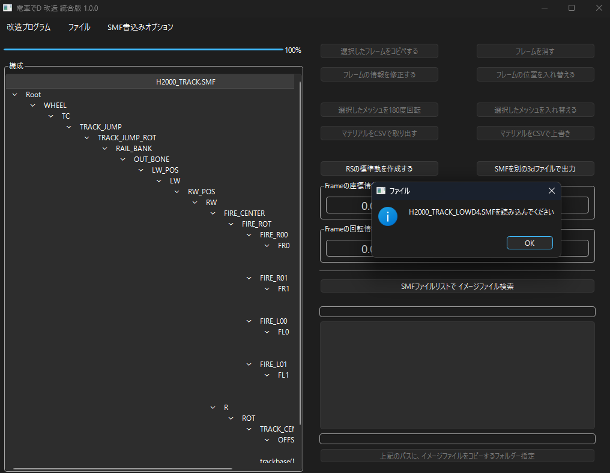
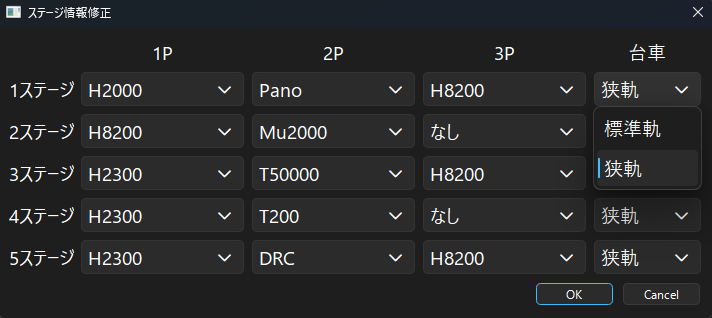
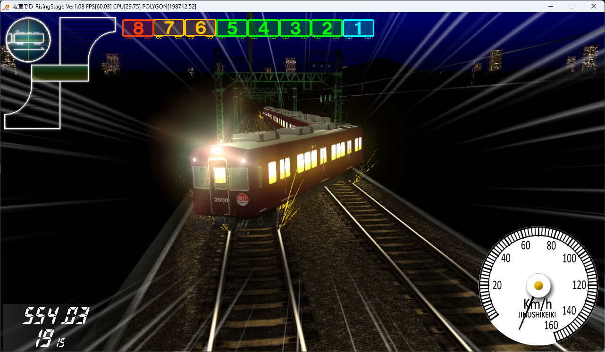

*[日本語](STANDARD.md)*

# How to Run with Standard Gauge Models in RS

## Creating a Standard Gauge Model

First, load CS's standard gauge.

Using this model's mesh as a base, a standard gauge model is created.

The supported models are as follows:

| CS Model | RS Narrow Gauge (additionally loaded) | RS Standard Gauge (created automatically) |
| --- | --- | --- |
| H2000_TRACK.SMF | H2000_Track_LowD4.SMF | H2000_Track_D4.SMF |
| K8000_TRACK.SMF | K8000_Track_LowD4.SMF | K8000_Track_D4.SMF |
| JR2000_TRACK_LOW2.SMF | JR2000_Track_LowD4.SMF | JR2000_Track_D4.SMF |
| K2100_TRACK.SMF | KQ2100_Track_LowD4.SMF | KQ2100_Track_D4.SMF |
| UV_TRACK.SMF | UV_Track_LowD4.SMF | UV_Track_D4.SMF |
| K800_TRACK.SMF | K800_Track_LowD4.SMF | K800_Track_D4.SMF |
| - | MUTRACK_LOW.SMF | Mu_Track_D4.SMF |

*Note: since only the Mu Sky's bogie has no standard gauge version,

it's handled by taking the info loaded from the Mu Sky's narrow gauge, "MUTRACK_LOW.SMF",

and stretching it sideways.

Using the "Create RS Standard Gauge" button

and loading files as instructed, you can create an RS-only standard gauge.

## Applying Standard Gauge to a Stage

In train performance, load "TRAIN_DATA4TH.BIN".

From there, in "Change Stage Default Train",

you can change the bogie that gets applied.

