*[日本語](TRACK_JOINT.md)*

# Bogie Position, Adjusting Distance Between Cars

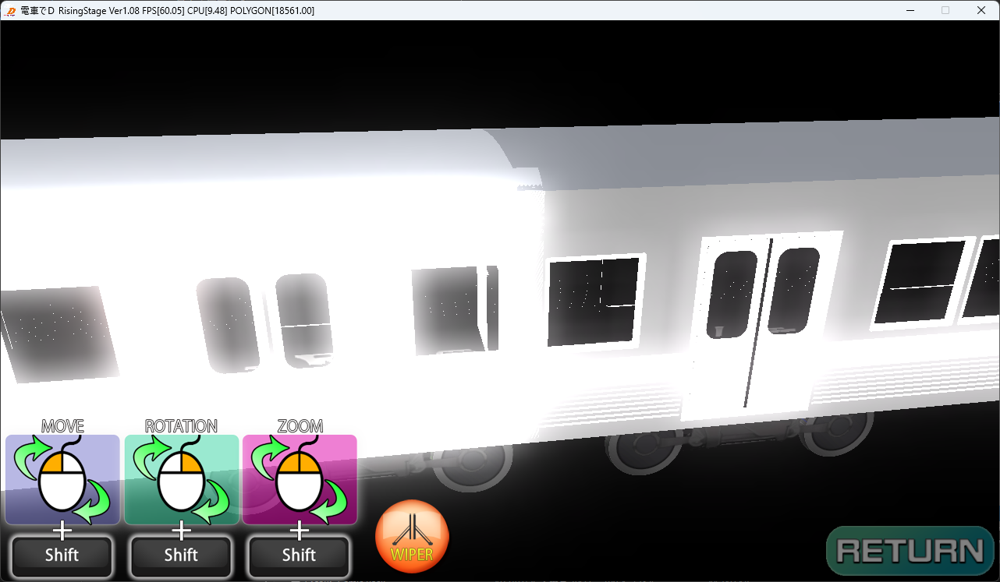

When assembling a train set, depending on the model's length,

if the cars end up overlapping like this,

you need to change the position of "F_JOINT" and "B_JOINT" in the SMF

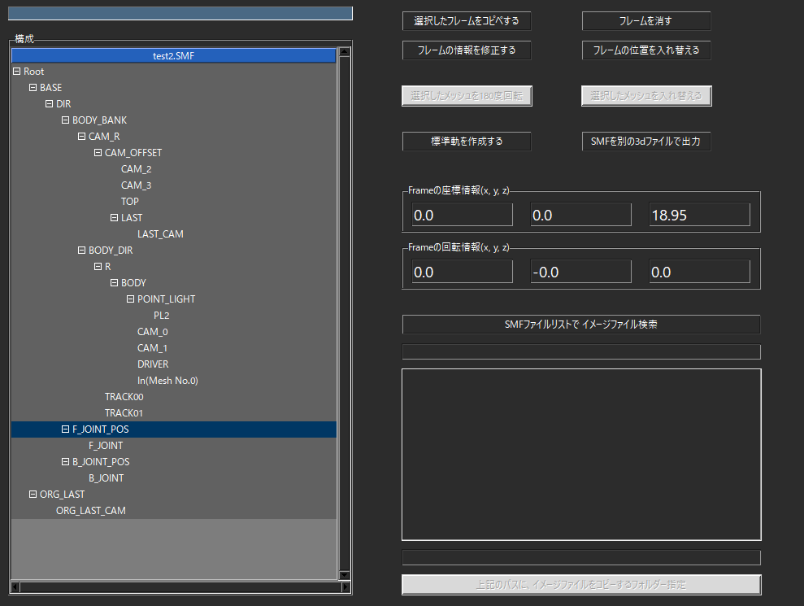

Also, depending on the model, "F_JOINT_POS" and "B_JOINT_POS" may be

defined, so adjust them as needed.

You only need to adjust the "Z coordinate"

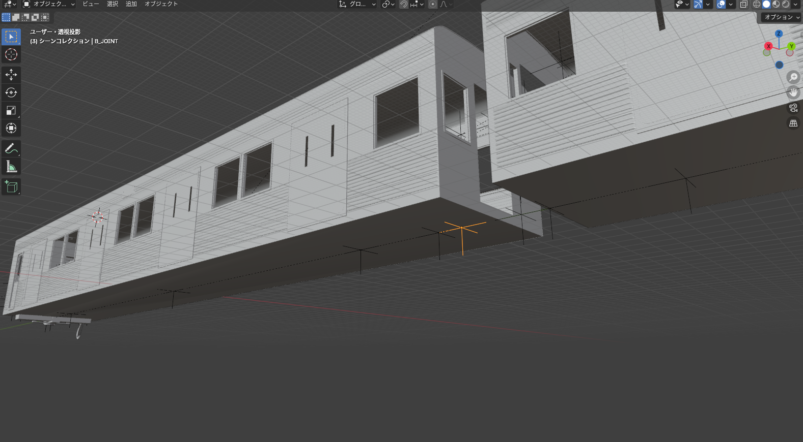

With the current settings, the "B_JOINT" position of the lead car is here

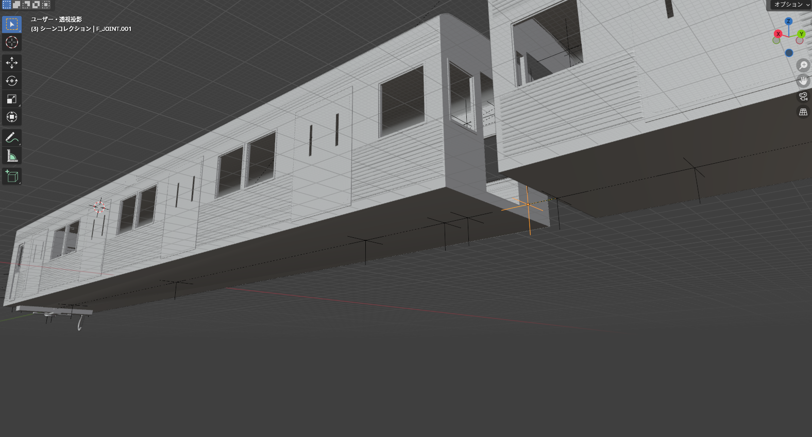

and since the "F_JOINT" position of car 2 is here,

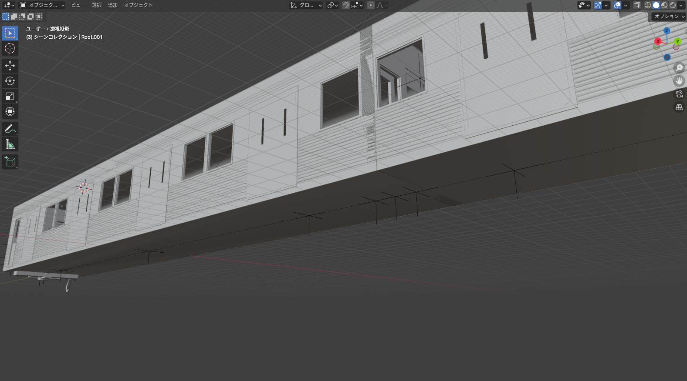

when assembling, the cars are placed to align the "B_JOINT" and "F_JOINT" positions,

so an overlapping section like this ends up occurring

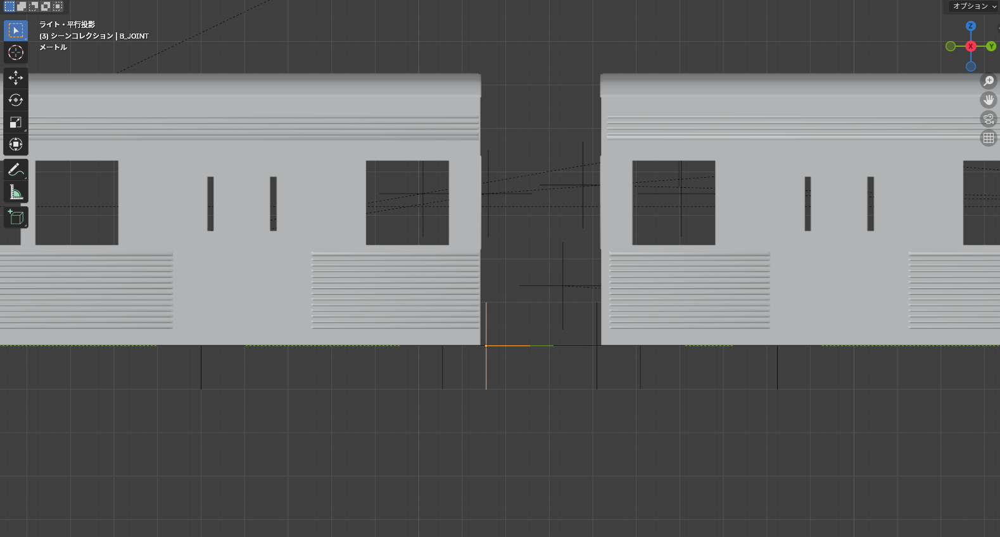

Therefore, adjust so the "B_JOINT" position ends up here

(change B_JOINT_POS to -20.55)

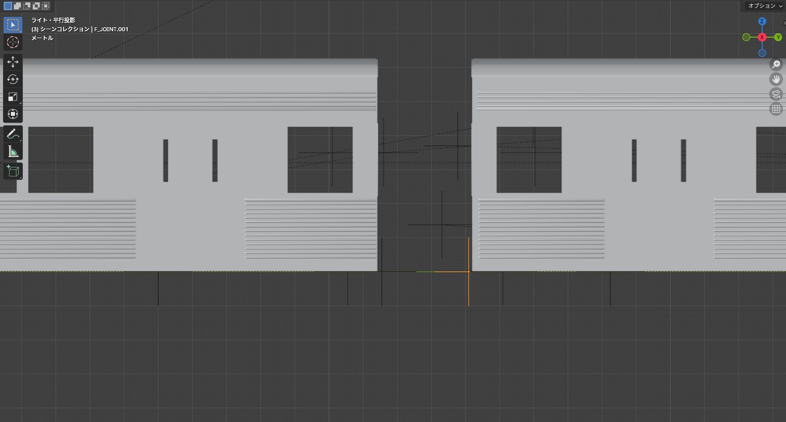

and adjust so the "F_JOINT" position ends up here

(change F_JOINT_POS to 18.15)

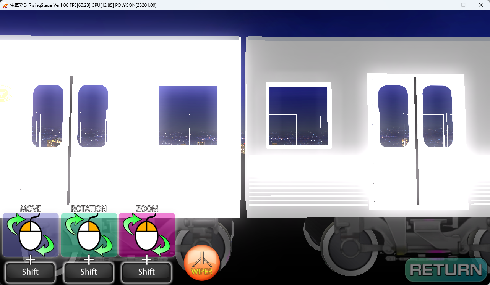

and it will be arranged like this.

Adjust with appropriate values.

   

## Bogie Position

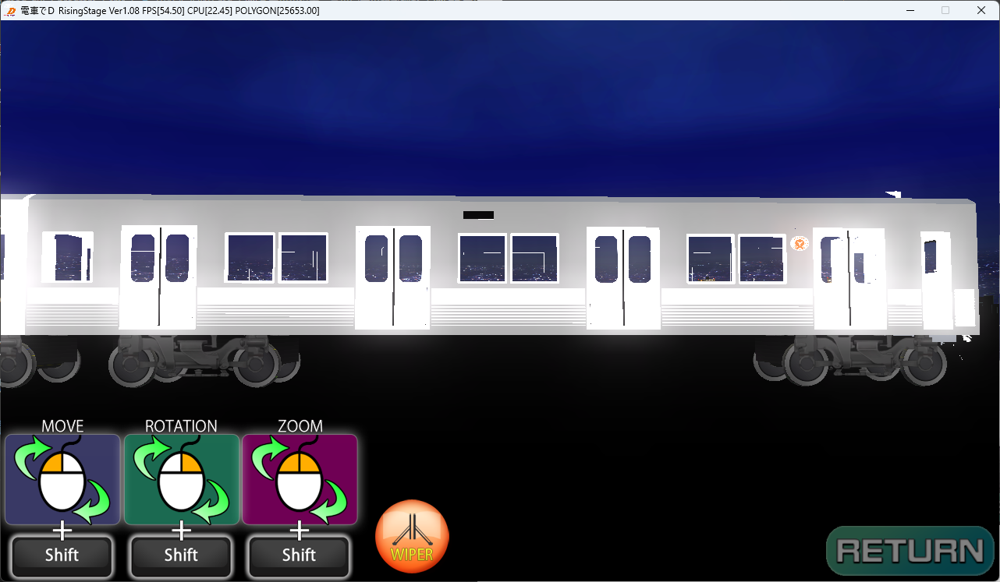

To adjust the bogie position,

adjust the position of the model's "TRACK00" and "TRACK01"

*The current Z value of TRACK00 is "15.0", and the Z value of TRACK01 is "-15.0"

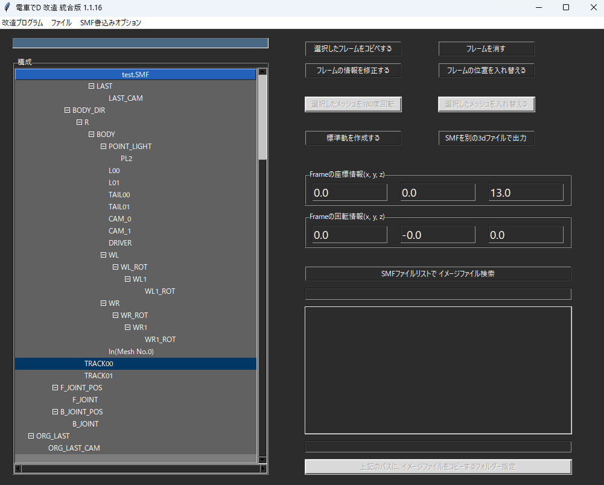

If you set TRACK00's value to "13.0" and TRACK01's Z value to "-17.0",

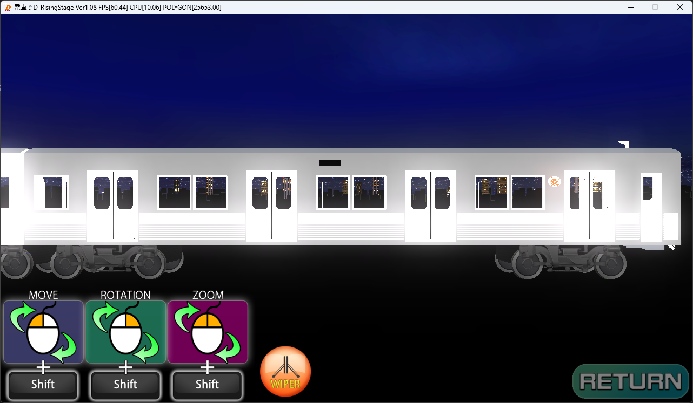

it will be adjusted like this.

Likewise, adjust with appropriate values.