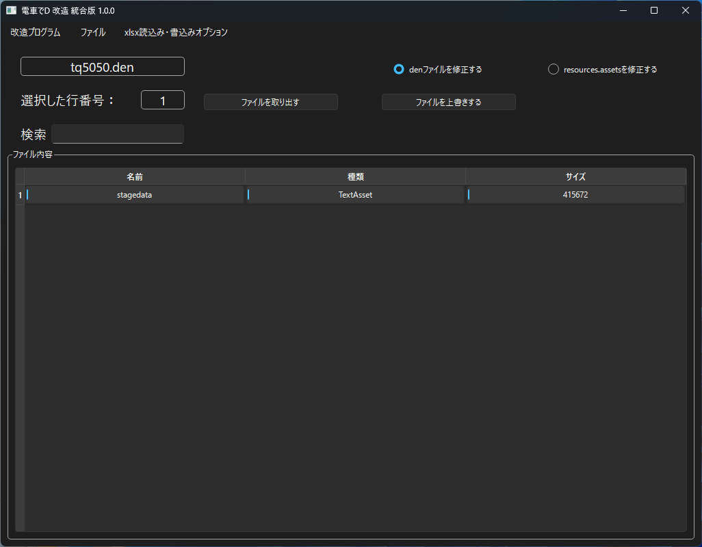
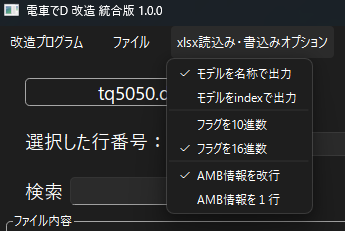
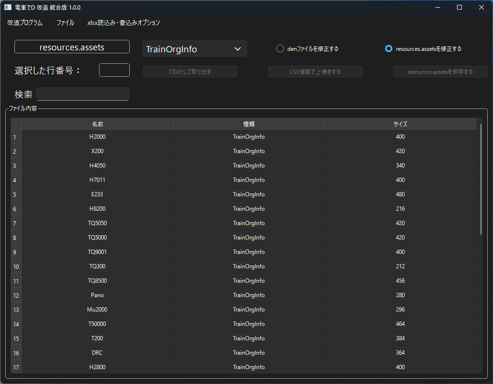
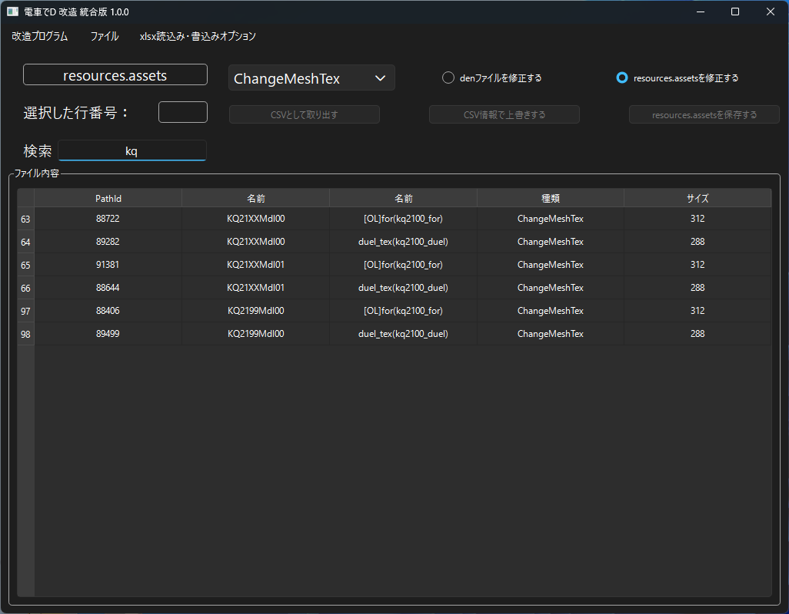

*[日本語](README.md)*

# SS Modification

## How to Run

In the menu's "Open File", open the specified file.

Be sure to work in a location where the program has write access.

### Modifying a den File

The "Extract File" button lets you extract the specified file.

The "Overwrite File" button lets you overwrite it by loading the specified file.

If the file is stagedata, you can also extract and overwrite it using Excel.

Also, when extracting stagedata to Excel,

you can check for several errors and elements that need attention.

 

However, currently, the library UnityPy that this depends on

can only overwrite TextAsset.

It's also not possible to add or delete entries, so

if you need to do that, you'll need to create it with a Unity program.

You can enter a keyword in the search box to filter data whose name partially matches it.

### Excel Read/Write Options

You can select options when extracting to or overwriting from Excel.

* Output the model as a name, or output it as an absolute index value.

* Output/input flag elements in decimal, or in hexadecimal.

* Output/input AMB results with a line break per AMB model info unit, or all on one line.

### Modifying resources.assets

You can modify TrainOrgInfo and ChangeMeshTex found in resources.assets.

- TrainOrgInfo

  Defines the train car and pantograph models, and their respective train set configurations.

- ChangeMeshTex

  Defines, as a list, which texture is used to display the train car's rollsign (destination display).

You can extract each of these elements as CSV, or overwrite them.

You can enter a keyword in the search box to filter data whose name partially matches it.

The "Save resources.assets" button

creates a new 【resources_new.assets】 that bundles together all the changes overwritten so far.

### FAQ

* Q. I modified the file, but nothing changed?

  * A. For den files, since the file in the folder with the highest version number under InGameData is prioritized for loading,

    make sure to place your modified file in the latest folder.

* Q. The download is blocked, execution is blocked, or my security software deletes it

  * A. Since the software isn't signed, some browsers may block the download.

  * A. For the same reason, some security software may refuse to let it run.

* Q. I get an error when extracting or overwriting a file with Excel?

  * A. When extracting, the data overwritten as txt is probably inconsistent;

    when overwriting, the Excel data is probably inconsistent.

    If you get an error while extracting, try overwriting with properly formed data in txt first, then try again.

The end.
